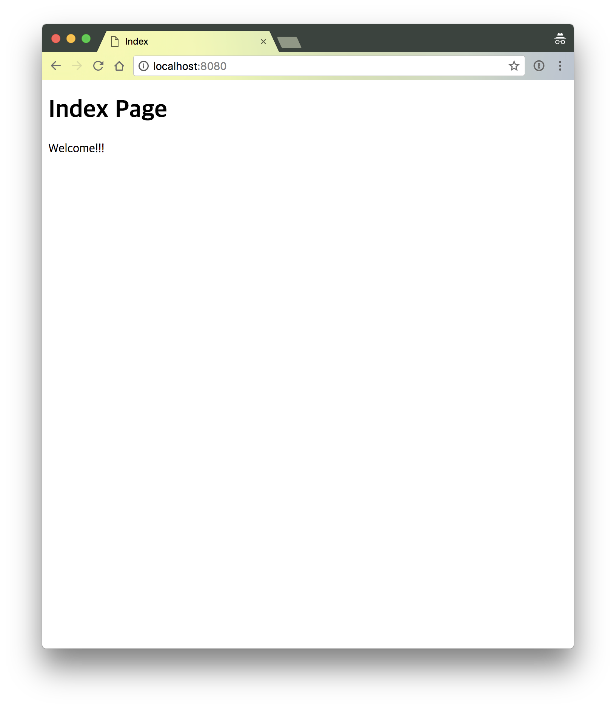

# Ch.03 - 브라우저로 봅시다

눈에 보이는 뭔가가 있어야 손대는 맛이 있는 법.
실행한 애플리케이션이 웹 페이지를 출력하도록 기능을 추가한다.

## STEP 1 - 일단 디자인

출력할 웹 페이지의 HTML 파일을 만든다. 이 파일은 그대로 Thymeleaf의 템플릿으로 사용한다.

```html
<!DOCTYPE html>
<html>
<head>
    <meta charset="UTF-8"/>
    <title>Index</title>
</head>
<body>
<h1>Index Page</h1>
<p>Welcome!!!</p>
</body>
</html>
```

단순히 에러가 나지 않고, 페이지를 보일 수 있는 [HTML 파일](../../src/main/resources/templates/_/index.html)을 추가 한다.


### 프로젝트 구조

```
./src/main
├── java
│   └── hemoptysisheart
│       └── github
│           └── com
│               └── tutorial
│                   └── spring
│                       └── web
│                           └── ApplicationRunner.java
└── resources
    └── templates
        └── _
            └── index.html
```

[전체 구조](step_1_tree.txt)

## STEP 2 - HTML 출력

루트패스(`http://localhost:8080` 혹은 `http://localhost:8080/`) 리퀘스트에 `src/main/resources/templates/_/index.html`의 HTML을 응답할 수 있도록 설정한다.

먼저, `pom.xml`에 템플릿 엔진인 Thymeleaf를 추가한다.

```xml
<dependency>
    <groupId>org.springframework.boot</groupId>
    <artifactId>spring-boot-starter-thymeleaf</artifactId>
</dependency>
```

컨트롤러를 구현한다.

```java
package hemoptysisheart.github.com.tutorial.spring.web;

import org.springframework.stereotype.Controller;
import org.springframework.ui.Model;
import org.springframework.web.bind.annotation.GetMapping;

@Controller
public class RootController {
    @GetMapping
    public String index(final Model model) {
        return "_/index";
    }
}
```

웹 애플리케이션을 [실행하고](step_2_bootup_web_application.log),

```
  .   ____          _            __ _ _
 /\\ / ___'_ __ _ _(_)_ __  __ _ \ \ \ \
( ( )\___ | '_ | '_| | '_ \/ _` | \ \ \ \
 \\/  ___)| |_)| | | | | || (_| |  ) ) ) )
  '  |____| .__|_| |_|_| |_\__, | / / / /
 =========|_|==============|___/=/_/_/_/
 :: Spring Boot ::        (v2.0.2.RELEASE)

    ...

2018-05-22 17:56:13.200  INFO 2677 --- [           main] o.s.b.w.embedded.tomcat.TomcatWebServer  : Tomcat started on port(s): 8080 (http) with context path ''
2018-05-22 17:56:13.205  INFO 2677 --- [           main] h.g.c.t.spring.web.ApplicationRunner     : Started ApplicationRunner in 1.83 seconds (JVM running for 2.838)
```

브라우저에서 [리퀘스트를 보낸다](step_2_request_root_path.log).

```
2018-05-22 17:59:15.276  INFO 2677 --- [nio-8080-exec-1] o.a.c.c.C.[Tomcat].[localhost].[/]       : Initializing Spring FrameworkServlet 'dispatcherServlet'
2018-05-22 17:59:15.276  INFO 2677 --- [nio-8080-exec-1] o.s.web.servlet.DispatcherServlet        : FrameworkServlet 'dispatcherServlet': initialization started
2018-05-22 17:59:15.289  INFO 2677 --- [nio-8080-exec-1] o.s.web.servlet.DispatcherServlet        : FrameworkServlet 'dispatcherServlet': initialization completed in 13 ms
```



### 프로젝트 구조

```
./src/main
├── java
│   └── hemoptysisheart
│       └── github
│           └── com
│               └── tutorial
│                   └── spring
│                       └── web
│                           ├── ApplicationRunner.java
│                           └── RootController.java
└── resources
    └── templates
        └── _
            └── index.html
```

[전체 구조](step_2_tree.txt)