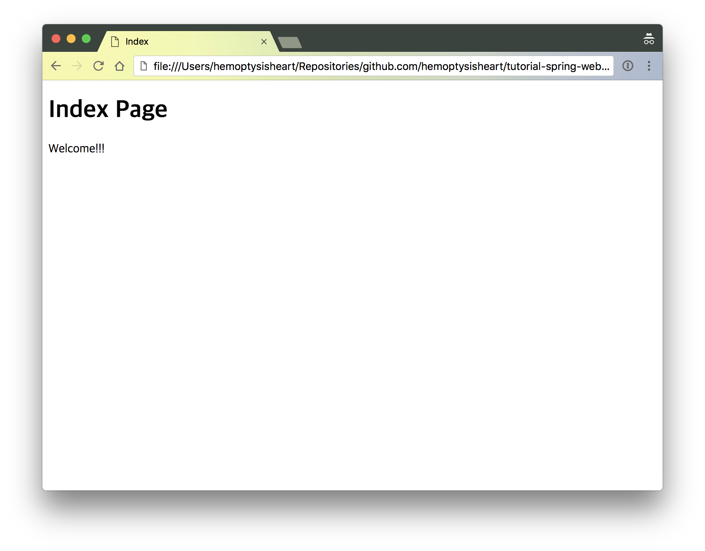

# Ch.03 - 브라우저로 봅시다

눈에 보이는 뭔가가 있어야 손대는 맛이 있는 법.
실행한 애플리케이션이 웹 페이지를 출력하도록 기능을 추가한다.

## STEP 1 - 일단 디자인

출력할 웹 페이지의 HTML 파일을 만든다. 이 파일은 그대로 Thymeleaf의 템플릿으로 사용한다.

```html
<!DOCTYPE html>
<html>
<head>
    <meta charset="UTF-8"/>
    <title>Index</title>
</head>
<body>
<h1>Index Page</h1>
<p>Welcome!!!</p>
</body>
</html>
```

단순히 에러가 나지 않고, 페이지를 보일 수 있는 [HTML 파일](../../src/main/resources/templates/_/index.html)을 추가 한다.



```
./src
├── main
│   ├── java
│   │   └── hemoptysisheart
│   │       └── github
│   │           └── com
│   │               └── tutorial
│   │                   └── spring
│   │                       └── web
│   │                           └── ApplicationRunner.java
│   └── resources
│       └── templates
│           └── _
│               └── index.html
└── test
    └── java
```

[전체 구조](step_1_tree.txt)