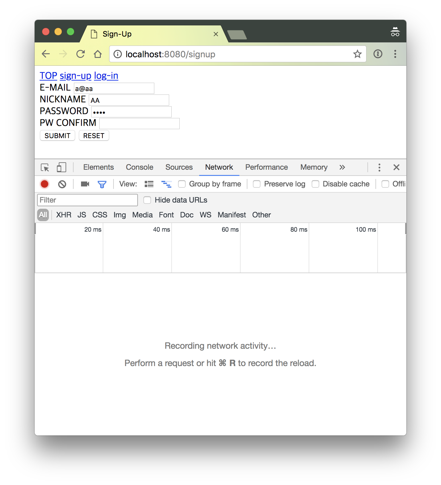
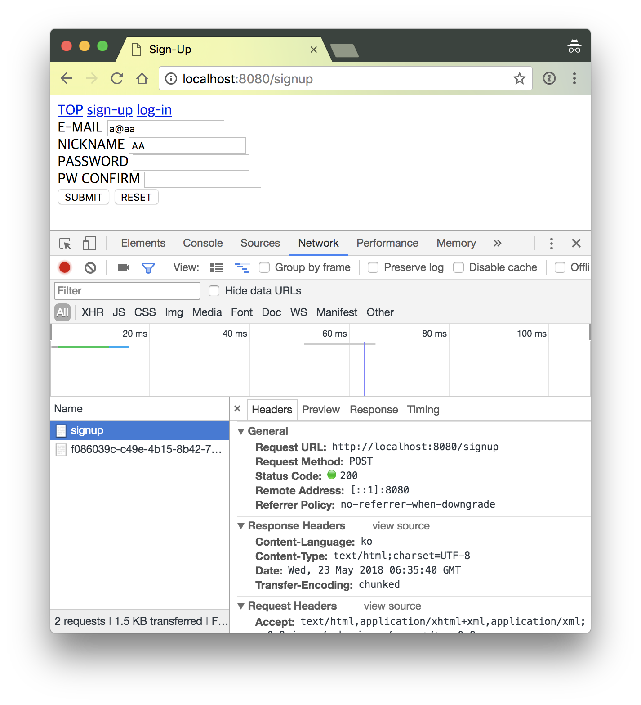
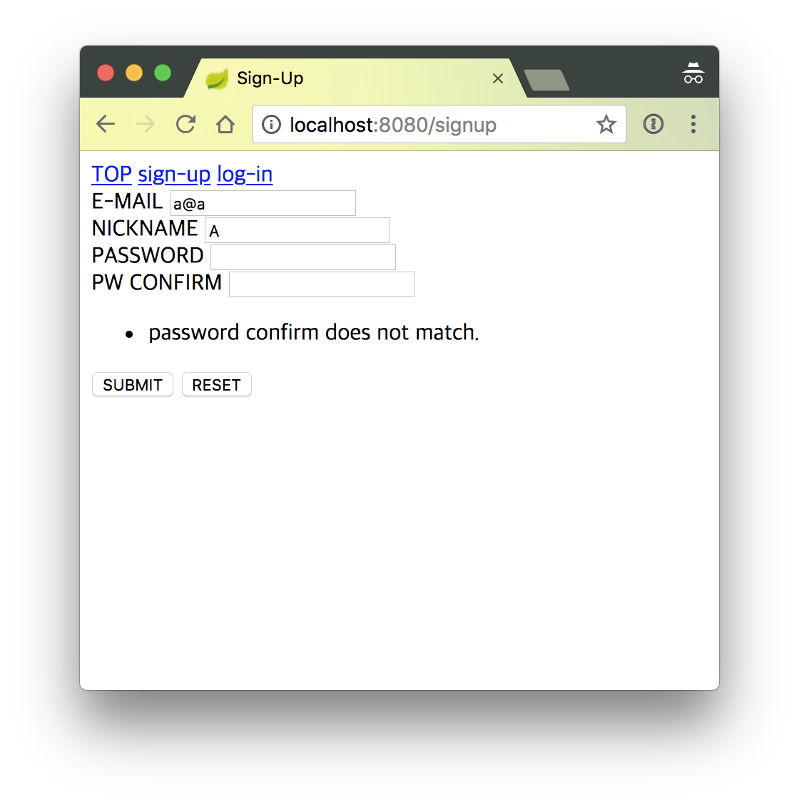

# CH.04 - 계정을 만들자

## STEP 1 - 회원가입 폼 출력하기

컨트롤러에 회원가입 폼을 출력하고 폼 서브밋을 처리하는 메서드를 추가한다`

* `@GetMapping("/signup") public String signUpForm(final Model model)` : `http://localhost:8080/signup` URL에 폼 페이지를 출력한다.
* `@PostMapping("/signup") public String signUp(@ModelAttribute @Valid final SignUpReq signUpReq, final Model model)` : 회원가입 폼 서브밋을 받아 처리한다.

```java
package hemoptysisheart.github.com.tutorial.spring.web;

import org.springframework.stereotype.Controller;
import org.springframework.ui.Model;
import org.springframework.web.bind.annotation.GetMapping;
import org.springframework.web.bind.annotation.ModelAttribute;
import org.springframework.web.bind.annotation.PostMapping;

import javax.validation.Valid;
import java.time.ZonedDateTime;

@Controller
public class RootController {
    @GetMapping
    public String index(final Model model) {
        model.addAttribute("timestamp", ZonedDateTime.now());
        return "_/index";
    }

    @GetMapping("/signup")
    public String signUpForm(final Model model) {
        model.addAttribute("signUpReq", new SignUpReq());
        return "_/signup";
    }

    @PostMapping("/signup")
    public String signUp(@ModelAttribute @Valid final SignUpReq signUpReq, final Model model) {
        return "redirect:/";
    }
}
```

폼 정보를 바인딩할 인스턴스를 추가한다. 폼 데이터의 형식 기반 검증을 할 수 있는 어노테이션을 추가한다.

```java
package hemoptysisheart.github.com.tutorial.spring.web;

import javax.validation.constraints.Email;
import javax.validation.constraints.NotNull;
import javax.validation.constraints.Size;

public class SignUpReq {
    @NotNull
    @Email
    private String email;
    @NotNull
    @Size(min = 1)
    private String nickname;
    @NotNull
    @Size(min = 4)
    private String password;
    @NotNull
    @Size(min = 4)
    private String confirm;

    // Getter, Setter and toString()
}
```

회원가입 폼 출력에 사용할 템플릿(`_/signup`)을 추가한다.

```html
<!DOCTYPE html>
<html xmlns:th="http://www.thymeleaf.org">
<head>
    <meta charset="UTF-8"/>
    <title>Sign-Up</title>
</head>
<body>
<header>
    <nav>
        <a href="index.html" th:href="@{/}">TOP</a>
        <a href="signup.html" th:href="@{/signup}">sign-up</a>
        <a href="login.html" th:href="@{/login}">log-in</a>
    </nav>
</header>
<main>
    <form id="form-signup" action="index.html" method="post"
          th:action="@{/signup}"></form>
    <!--/*@thymesVar id="signUpReq" type="hemoptysisheart.github.com.tutorial.spring.web.SignUpReq"*/-->
    <div th:object="${signUpReq}">
        <div>
            <label for="email">E-MAIL</label>
            <input type="email" id="email" form="form-signup" required="required"
                   th:field="*{email}"/>
        </div>
        <div>
            <label for="nickname">NICKNAME</label>
            <input id="nickname" form="form-signup" required="required"
                   th:field="*{nickname}"/>
        </div>
        <div>
            <label for="password">PASSWORD</label>
            <input type="password" id="password" form="form-signup" required="required" pattern=".{4,}"
                   th:field="*{password}"/>
        </div>
        <div>
            <label for="confirm">PW CONFIRM</label>
            <input type="password" id="confirm" form="form-signup" required="required" pattern=".{4,}"
                   th:field="*{confirm}"/>
        </div>
        <div>
            <button form="form-signup">SUBMIT</button>
            <button type="reset" form="form-signup">RESET</button>
        </div>
    </div>
</main>
</body>
</html>
```

### 프로젝트 구조

```
./src/main
├── java
│   └── hemoptysisheart
│       └── github
│           └── com
│               └── tutorial
│                   └── spring
│                       └── web
│                           ├── ApplicationRunner.java
│                           ├── RootController.java
│                           └── SignUpReq.java
└── resources
    ├── application.yml
    └── templates
        └── _
            ├── index.html
            └── signup.html
```

[전체 구조](step_1_tree.txt)

## STEP 2 - 검증 실패에 대응하기 : 1. 기본적인 검증 실패 처리하기

HTML5 지원 브라우저의 검증기능을 사용해 서브밋 하기 전에 검증을 했지만, 테스트를 위해 일부를 삭제한다.
비밀번호 재입력 컨트롤에서 `required`와 `pattern` 속성을 제거했다.

```xml
<div>
    <label for="confirm">PW CONFIRM</label>
    <input type="password" id="confirm" form="form-signup"
           th:field="*{confirm}"/>
</div>
```

컨트롤러에는 검증(validation) 결과를 모델 어트리뷰트가 아닌 인자로 받을 수 있도록 인자(`BindingResult binding`)를 추가한다.
바인딩 인스턴스에 검증 에러가 있다면 다시 회원가입 폼을 출력한다.

```java
@PostMapping("/signup")
public String signUp(@ModelAttribute @Valid final SignUpReq signUpReq, final BindingResult binding, final Model model) {
    if (binding.hasErrors()) {
        return "_/signup";
    } else {
        return "redirect:/";
    }
}
```

`@Size(min = 4)` 조건으로 4글자 이상을 입력해야 하는 `confirm` 필드에 값을 입력하지 않았다.
임시로 HTML 폼에서 `required`, `pattern` 속성을 제거했기 때문에 브라우저에서 서브밋 할 수 있다.



에러가 있기 때문에 `http://localhost:8080/`로 리다이렉트 되지 않고 회원가입 폼을 출력하되, 폼 입력값을 설정한 그대로 출력한다.
단, `<input type="password" />`인 `password`, `confirm` 인풋 컨트롤은 값을 지정하지 않는다.
`Status Code`가 `302` 혹은 `301`으로 `http://localhost:8080/signup`으로 리다이렉트 하지 않고,
정상 상태인 `200`으로 응답하면서 HTTP 응답 본문에 직접 폼을 출력한다.



이번에는 템플릿 파일을 직접 수정해서 테스트했지만, 정상적인 경우라면 브라우저의 검증도구에서 속성을 수정 혹은 삭제해서 테스트 할 수 있다.

## STEP 3 - 검증 실패에 대응하기 : 2. 커스텀 검증, 비밀번호 재입력 검증하기

비밀번호는 기본적으로 보이지 않는다. 그래서 유저는 자신이 실재로 입력한 값이 무엇인지 알 수가 없다.
그래서 비밀번호를 한번 더 입력해 오타에 대비한다.
서버쪽에서는 `hemoptysisheart.github.com.tutorial.spring.web.SignUpReq.password`와 `SignUpReq.confirm`이 같은지 확인하고,
서로 다른 경우에는 에러 메시지를 출력하기 위해 인자로 받은 `org.springframework.validation.BindingResult` 인스턴스에 에러를 추가한다.

```java
@PostMapping("/signup")
public String signUp(@ModelAttribute("signUpReq") @Valid final SignUpReq signUpReq, final BindingResult binding, final Model model) {
    if (!signUpReq.getPassword().equals(signUpReq.getConfirm())) {
        binding.addError(new FieldError("signUpReq", "confirm", "password does not match."));
    }

    if (binding.hasErrors()) {
        return "_/signup";
    } else {
        return "redirect:/";
    }
}
```

1. `signUpReq.getPassword().equals(signUpReq.getConfirm())` : `password` 필드와 `confirm` 필드를 비교하고
1. `if(! ... )` : 값이 다르다면
1. `binding.addError(new FieldError("signUpReq", "confirm", "password does not match."))` : `binding`에 에러 정보를 추가한다.



`FieldError` 인스턴스를 만들 때 사용한 에러메시지 `"password does not match."`가 출력된다.