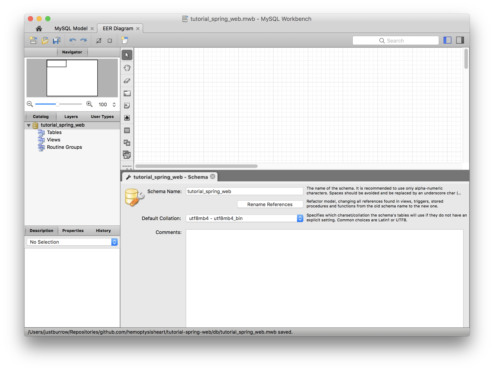
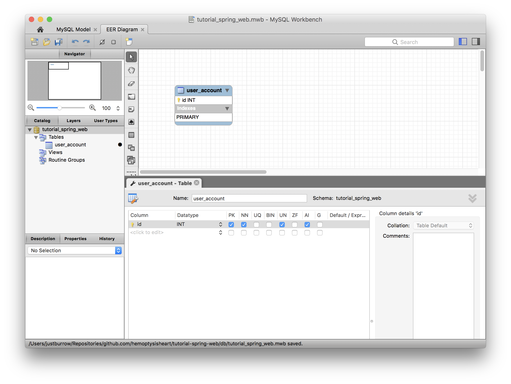
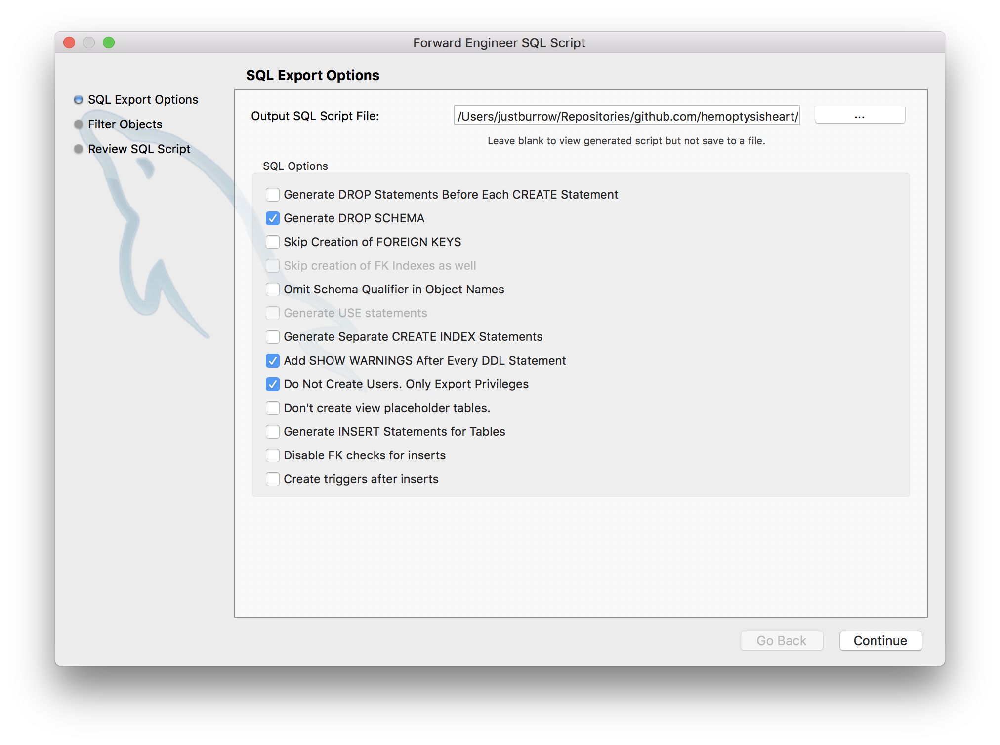
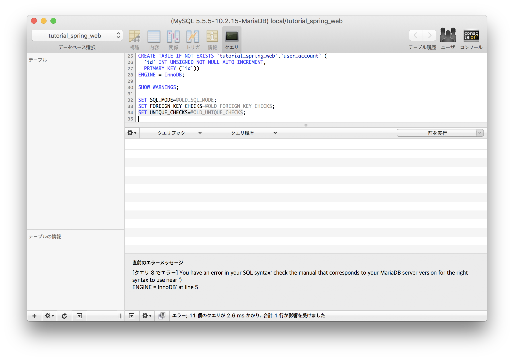

# CH.05 - JPA 설정

현실적으로는 DB에 연동해야만 데이터를 잃어버리지 않고 저장하고 사용할 수 있다.
MySQL을 사용한 데이터 저장을 시도한다.

## STEP 1 - 연결할 DB 만들기

회원 가입한 계정 정보를 저장해야 한다.
해당 DB를 만든다. DB 스키마 작성은 MySQL Workbench를 사용한다.
MySQL Workbench에서 모델을 만들고 DDL을 생성하면,
DDL의 테이블 순서가 유지된다.
이것은 DB 변경을 추적하기 위해 매우 중요한 특징이 된다.
(`mysqldump`는 순서가 유지되지 않는다.)

모델을 추가한다.
스키마 이름을 변경하고, `Default Collation`을 `utf8mb4 - utf8mb4_bin`으로 변경한다.
DDL에서 스키마의 `character set`을 `utf8mb4`로, `collate`를 `utf8mb4_bin`으로 설정된다.



MySQL Workbench가 DDL 생성시 스키마를 생성하려면 테이블이 하나는 필요하다.
임시로 PK만 있는 테이블을 추가한다. 이후 회원 가입한 계정 정보 저장에 사용한다.



`Menu > File > Export > Forward Engineer SQL CREATE Script...`(<kbd><kbd>shift</kbd> + <kbd>command</kbd> + <kbd>G</kbd></kbd>)로 DDL파일(`*.sql`)을 생성한다.



DDL을 실행해 스키마를 생성한다.



### 프로젝트 구조

```
.
├── db
│   ├── tutorial_spring_web.mwb
│   └── tutorial_spring_web.sql
├── pom.xml
└── src
    └── main
        ├── java
        │   └── hemoptysisheart.github.com.tutorial.spring.web
        │       ├── ApplicationRunner.java
        │       ├── RootController.java
        │       └── SignUpReq.java
        └── resources
            ├── application.yml
            └── templates
                └── _
                    ├── index.html
                    └── signup.html
```
[전체 구조](step_1_tree.txt)

## STEP 2 - 의존성 추가하기

JPA의존성을 추가하고, DB 연결을 위해 커넥터를 추가한다.

```xml
<dependency>
    <groupId>org.springframework.boot</groupId>
    <artifactId>spring-boot-starter-data-jpa</artifactId>
</dependency>
<dependency>
    <groupId>mysql</groupId>
    <artifactId>mysql-connector-java</artifactId>
</dependency>
```

## STEP 3 - DB 연결하기

JPA도 기본적으로는 JDBC를 기반으로 작동한다.

* `spring.datasource.hikari` : Spring Boot 2.0 부터 기본 DB 커넥션 풀 관리자가 된 HikariCP 설정.
* `spring.jpa` : JPA(Spring Data JPA) 설정.

```yaml
spring:
  datasource:
    hikari:
      driver-class-name: com.mysql.jdbc.Driver
      jdbc-url: jdbc:mysql://localhost/tutorial_spring_web?connectionCollation=utf8mb4_bin
      username: root
      password: ''
      idle-timeout: 12000
      connection-test-query: SELECT 1
  jpa:
    database: mysql
    open-in-view: false
```

[전체 설정](../../src/main/resources/application.yml)

JPA JavaConfig 설정 추가.

```java
package hemoptysisheart.github.com.tutorial.spring.web;

import org.springframework.boot.context.properties.ConfigurationProperties;
import org.springframework.boot.jdbc.DataSourceBuilder;
import org.springframework.context.annotation.Bean;
import org.springframework.context.annotation.Configuration;
import org.springframework.data.jpa.repository.config.EnableJpaRepositories;
import org.springframework.orm.hibernate5.HibernateExceptionTranslator;
import org.springframework.orm.jpa.JpaTransactionManager;
import org.springframework.orm.jpa.LocalContainerEntityManagerFactoryBean;
import org.springframework.orm.jpa.vendor.Database;
import org.springframework.orm.jpa.vendor.HibernateJpaVendorAdapter;
import org.springframework.transaction.PlatformTransactionManager;
import org.springframework.transaction.annotation.EnableTransactionManagement;

import javax.sql.DataSource;

@Configuration
@EnableJpaRepositories
@EnableTransactionManagement
public class JpaConfiguration {
    @Bean
    @ConfigurationProperties("spring.datasource.hikari")
    public DataSource dataSource() {
        return DataSourceBuilder.create().build();
    }

    @Bean
    public LocalContainerEntityManagerFactoryBean entityManagerFactory() {
        HibernateJpaVendorAdapter adapter = new HibernateJpaVendorAdapter();
        adapter.setDatabase(Database.MYSQL);
        LocalContainerEntityManagerFactoryBean factory = new LocalContainerEntityManagerFactoryBean();
        factory.setDataSource(dataSource());
        factory.setPackagesToScan(JpaConfiguration.class.getPackageName());
        factory.setJpaVendorAdapter(adapter);
        return factory;
    }

    @Bean
    public PlatformTransactionManager transactionManager() {
        return new JpaTransactionManager(entityManagerFactory().getObject());
    }

    @Bean
    public HibernateExceptionTranslator hibernateExceptionTranslator() {
        return new HibernateExceptionTranslator();
    }
}
```

### 프로젝트 구조

```
./src/main
├── java
│   └── hemoptysisheart.github.com.tutorial.spring.web
│       ├── ApplicationRunner.java
│       ├── JpaConfiguration.java
│       ├── RootController.java
│       └── SignUpReq.java
└── resources
    ├── application.yml
    └── templates
        └── _
            ├── index.html
            └── signup.html
```
[전체 구조](step_3_tree.txt)

### 웹 애플리케이션 실행 로그

JPA, Hibernate, HikariCP 관련 로그를 볼 수 있다.

```
2018-05-24 13:38:26.615  INFO 4195 --- [           main] j.LocalContainerEntityManagerFactoryBean : Building JPA container EntityManagerFactory for persistence unit 'default'
2018-05-24 13:38:26.624  INFO 4195 --- [           main] o.hibernate.jpa.internal.util.LogHelper  : HHH000204: Processing PersistenceUnitInfo [
	name: default
	...]
2018-05-24 13:38:26.681  INFO 4195 --- [           main] org.hibernate.Version                    : HHH000412: Hibernate Core {5.2.17.Final}
2018-05-24 13:38:26.683  INFO 4195 --- [           main] org.hibernate.cfg.Environment            : HHH000206: hibernate.properties not found
2018-05-24 13:38:26.714  INFO 4195 --- [           main] o.hibernate.annotations.common.Version   : HCANN000001: Hibernate Commons Annotations {5.0.1.Final}
2018-05-24 13:38:26.793  INFO 4195 --- [           main] com.zaxxer.hikari.HikariDataSource       : HikariPool-1 - Starting...
2018-05-24 13:38:26.950  INFO 4195 --- [           main] com.zaxxer.hikari.HikariDataSource       : HikariPool-1 - Start completed.
2018-05-24 13:38:26.961  INFO 4195 --- [           main] org.hibernate.dialect.Dialect            : HHH000400: Using dialect: org.hibernate.dialect.MySQL5Dialect
2018-05-24 13:38:27.142  INFO 4195 --- [           main] j.LocalContainerEntityManagerFactoryBean : Initialized JPA EntityManagerFactory for persistence unit 'default'
```
[전체 로그](step_3_bootup.log)

## STEP 4 - JPA Entity

계정정보를 다룰 때 사용할 JPA 엔티티를 정의한다.

* `@Entity` : 이 클래스의 인스턴스가 JPA 엔티티임을 표시하며, 엔티티 매니저가 어떤 이름으로 다룰 것인지를 지정한다.
* `@Table` : 엔티티의 데이터를 동기화할 테이블의 정보. 테이블 이름과 인덱스를 포함한다.
* `@Id` : 엔티티의 ID가 되는 필드.
* `@GeneratedValue` : Java 로직이 아닌 다른 방식으로 값이 할당되는 필드.
`strategy = GenerationType.IDENTITY`는 MySQL의 `AUTO_INCREMENT` 컬럼과 동기화 한다는 뜻.
* `@Column` : 필드값이 하나의 컬럼과 동기화되는 경우에 컬럼의 정보를 제공한다.
* `private AccountEntity() { ... }` : JPA는 인자 없는 생성자 메서드가 반드시 필요하다.
Java 로직에서는 필요없으므로 `private`로 접근을 제한.

```java
package hemoptysisheart.github.com.tutorial.spring.web;

import javax.persistence.*;

import static java.lang.String.format;

@Entity(name = "Account")
@Table(name = "user_account",
        uniqueConstraints = {@UniqueConstraint(name = "UQ_ACCOUNT_EMAIL", columnNames = {"email"}),
                @UniqueConstraint(name = "UQ_ACCOUNT_NICKNAME", columnNames = {"nickname"})})
public class AccountEntity {
    @Id
    @GeneratedValue(strategy = GenerationType.IDENTITY)
    @Column(name = "id", nullable = false, insertable = false, updatable = false)
    private int id;
    @Column(name = "email", unique = true, nullable = false, length = 255)
    private String email;
    @Column(name = "nickname", unique = true, nullable = false, length = 128)
    private String nickname;
    @Column(name = "passwd", nullable = false)
    private String password;

    private AccountEntity() {
    }

    public AccountEntity(String email, String nickname, String password) {
        setEmail(email);
        setNickname(nickname);
        setPassword(password);
    }

    // ... getter & setter ...

    @Override
    public int hashCode() {
        return this.id;
    }

    @Override
    public boolean equals(Object that) {
        if (0 < this.id && this == that) {
            return true;
        } else if (that instanceof AccountEntity && 0 < this.id) {
            return this.id == ((AccountEntity) that).id;
        } else {
            return false;
        }
    }
}
```
[AccountEntity.java](../../src/main/java/hemoptysisheart/github/com/tutorial/spring/web/AccountEntity.java)

엔티티에 맞춰 테이블을 수정한다.

```sql
CREATE TABLE IF NOT EXISTS `tutorial_spring_web`.`user_account` (
  `id` INT UNSIGNED NOT NULL AUTO_INCREMENT,
  `email` VARCHAR(255) NOT NULL,
  `nickname` VARCHAR(128) NOT NULL,
  `passwd` VARCHAR(60) NOT NULL,
  PRIMARY KEY (`id`),
  UNIQUE INDEX `UQ_ACCOUNT_EMAIL` (`email` ASC),
  UNIQUE INDEX `UQ_ACCOUNT_NICKNAME` (`nickname` ASC))
ENGINE = InnoDB;
```
[DDL](../../db/tutorial_spring_web.sql)

### 프로젝트 구조

```
./src/main
├── java
│   └── hemoptysisheart.github.com.tutorial.spring.web
│       ├── AccountEntity.java
│       ├── ApplicationRunner.java
│       ├── JpaConfiguration.java
│       ├── RootController.java
│       └── SignUpReq.java
└── resources
    ├── application.yml
    └── templates
        └── _
            ├── index.html
            └── signup.html
```
[전체 구조](step_4_tree.txt)

## STEP 5 - SQL(DML) 생성용 레포지토리 정의

인터페이스만 정의하면 Spring Data JPA가 프록시를 사용해 자동으로 SQL로 매핑해주는 레포지토리 컴포넌트를 생성한다.
`@Repository` 컴포넌트의 메서드는 `prepared statement`가 된다.

```java
package hemoptysisheart.github.com.tutorial.spring.web;

import org.springframework.data.jpa.repository.JpaRepository;
import org.springframework.stereotype.Repository;

@Repository
public interface AccountRepository extends JpaRepository<AccountEntity, Integer> {
    AccountEntity findOneByEmail(String email);

    AccountEntity findOneByNickname(String nickname);
}
```
[AccountRepository.java](../../src/main/java/hemoptysisheart/github/com/tutorial/spring/web/AccountRepository.java)

`AccountEntity findOneByNickname(String nickname)` 메서드의 경우 다음과 같은 의미가 되며,

* `findOne` : 엔티티 1개를
* `By` : 다음의 조건으로
* `Nickname` : 엔티티의 `nickname` 필드가 메서드 인자인 `String nickname`과 같은 경우에 선택한다.

인자 `nickname`의 값이 `"babo"` 라면 다음의 SQL이 실행된다.

```sql
SELECT
    *
FROM
    `user_account`
WHERE
    `nickname` = 'babo'
```

### 프로젝트 구조

```
./src/main
├── java
│   └── hemoptysisheart.github.com.tutorial.spring.web
│       ├── AccountEntity.java
│       ├── AccountRepository.java
│       ├── ApplicationRunner.java
│       ├── JpaConfiguration.java
│       ├── RootController.java
│       └── SignUpReq.java
└── resources
    ├── application.yml
    └── templates
        └── _
            ├── index.html
            └── signup.html
```
[전체 구조](step_5_tree.txt)