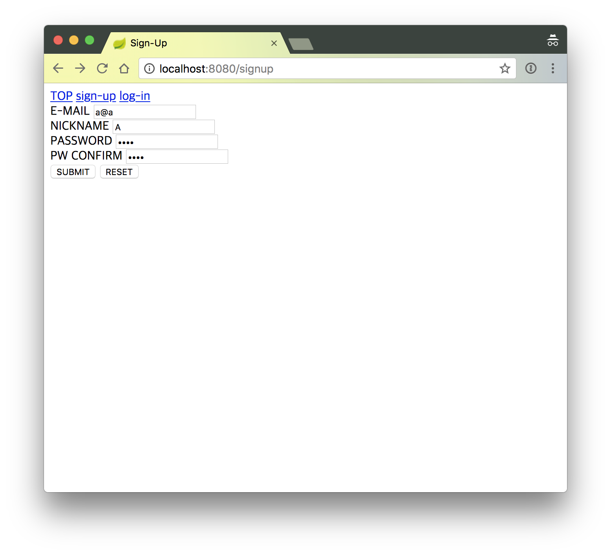
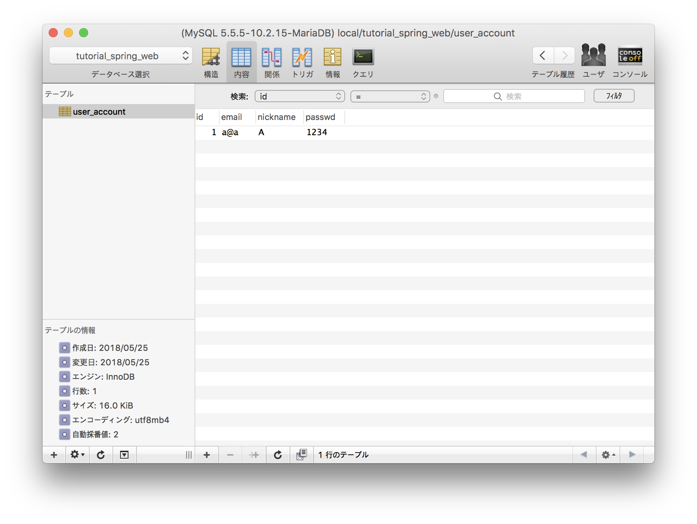

# CH.06 - 서비스 레이어

비지니스 로직을 가진 서비스 레이어의 컴포넌트를 추가한다.

## STEP 1 - 컴포넌트 추가

어쨌든 입력한 계정 정보를 저장하는 서비스 컴포넌트를 추가한다.

```java
package hemoptysisheart.github.com.tutorial.spring.web;

import org.springframework.beans.factory.annotation.Autowired;
import org.springframework.stereotype.Service;
import org.springframework.transaction.annotation.Transactional;

@Transactional
@Service
public class AccountService {
    @Autowired
    private AccountRepository accountRepository;

    public AccountEntity create(String email, String nickname, String password) {
        AccountEntity account = new AccountEntity(email, nickname, password);
        account = this.accountRepository.save(account);
        return account;
    }
}
```
[AccountService.java](../../src/main/java/hemoptysisheart/github/com/tutorial/spring/web/AccountService.java)

컨트롤러에는 서비스 컴포넌트를 호출하는 코드를 추가한다.

```java
package hemoptysisheart.github.com.tutorial.spring.web;

// ... 생략 ...

@Controller
public class RootController {
    @Autowired
    private AccountService accountService;

    // ... 생략 ...

    @PostMapping("/signup")
    public String signUp(@ModelAttribute("signUpReq") @Valid final SignUpReq signUpReq, final BindingResult binding, final Model model) {
        // ... 생략 ...

        if (binding.hasErrors()) {
            return "_/signup";
        } else {
            AccountEntity account = this.accountService.create(signUpReq.getEmail(), signUpReq.getNickname(), signUpReq.getPassword());
            return "redirect:/";
        }
    }
}
```
[RootController.java](../../src/main/java/hemoptysisheart/github/com/tutorial/spring/web/RootController.java)

새 계정 정보.



저장된 계정 정보.



### 프로젝트 구조

```
./src/main
├── java
│   └── hemoptysisheart
│       └── github
│           └── com
│               └── tutorial
│                   └── spring
│                       └── web
│                           ├── AccountEntity.java
│                           ├── AccountRepository.java
│                           ├── AccountService.java
│                           ├── ApplicationRunner.java
│                           ├── JpaConfiguration.java
│                           ├── RootController.java
│                           └── SignUpReq.java
└── resources
    ├── application.yml
    └── templates
        └── _
            ├── index.html
            └── signup.html
```
[전체 구조](step_1_tree.txt)

## STEP 2 - 속성의 변화에 대응하기

유저가 입력하는 계정 정보는 언제라도 바뀔 수 있다.
설혹 계정 정보는 바뀌지 않는다 하더라도, 다른 데이터는 선택하거나 입력할 수 있는 항목은 얼마든지 바뀔 수 있다.
메서드 인자가 늘거나 줄어든다면 메서드 시그니쳐가 바뀌고, 메서드를 사용하는 모든 코드를 수정해야 한다.
늘어난 항목은 기본값이 있어서 사용하지 않으면 자동으로 설정할 수 있음에도 불구하고.

이 문제는 로직에 필요한 데이터를 직접 인자로 넘기지 않고,
별도의 클래스로 묶어서 넘길 수 있다.

```java
package hemoptysisheart.github.com.tutorial.spring.web;

public class CreateAccountParams {
    private String email;
    private String nickname;
    private String password;

    // ... 생성자 메서드 ...

    // ... getters & setters ...
}
```
[CreateAccountParams.java](../../src/main/java/hemoptysisheart/github/com/tutorial/spring/web/CreateAccountParams.java)

인자를 바로 `new AccountEntity(...)`에 인자로 넘기지 않고, `params`에서 필요한 필드를 가져온다.

```java
public AccountEntity create(CreateAccountParams params) {
    AccountEntity account = new AccountEntity(params.getEmail(), params.getNickname(), params.getPassword());
    account = this.accountRepository.save(account);
    return account;
}
```
[AccountService.java](../../src/main/java/hemoptysisheart/github/com/tutorial/spring/web/AccountService.java)

바인딩된 데이터를 직접 메서드 인자로 넘기지 않고 `CreateAccountParams` 인스턴스를 만들어 넘긴다.

```java
@PostMapping("/signup")
public String signUp(@ModelAttribute("signUpReq") @Valid final SignUpReq signUpReq, final BindingResult binding, final Model model) {
    // ...
    if (binding.hasErrors()) {
        return "_/signup";
    } else {
        CreateAccountParams params = new CreateAccountParams(signUpReq.getEmail(), signUpReq.getNickname(), signUpReq.getPassword());
        AccountEntity account = this.accountService.create(params);
        return "redirect:/";
    }
}
```
[RootController.java](../../src/main/java/hemoptysisheart/github/com/tutorial/spring/web/RootController.java)

### 프로젝트 구조

```
./src/main
├── java
│   └── hemoptysisheart
│       └── github
│           └── com
│               └── tutorial
│                   └── spring
│                       └── web
│                           ├── AccountEntity.java
│                           ├── AccountRepository.java
│                           ├── AccountService.java
│                           ├── ApplicationRunner.java
│                           ├── CreateAccountParams.java
│                           ├── JpaConfiguration.java
│                           ├── RootController.java
│                           └── SignUpReq.java
└── resources
    ├── application.yml
    └── templates
        └── _
            ├── index.html
            └── signup.html
```
[전체 구조](step_2_tree.text)

## STEP 3 - 비지니스 로직과 JPA 분리가 필요한 이유

애플리케이션에서 비지니스 로직(보통 `@Service` 컴포넌트의 로직)은 구현해야 하는 기능과 오류 대응과 모니터링 로그 등등의 많은 기능 때문에 어쩔 수 없이 **복잡하다**.

JPA 레포지토리는 메서드 이름으로 SQL을 매핑하기 때문에 비지니스 로직의 코드와 다른 형식을 가진다.
그래서 비지니스 로직에서 JPA 레포지토리 메서드에 접근한다면 코드 스타일이 뒤섞여 더욱 복잡해진다.

DB의 문제도 있다. 예를 들면 MySQL은 `5.7`까지 내림차순 인덱스를 지원하지 않는다(`8.0`부터는 지원한다고 한다).
그래서 최신 데이터를 먼저 가져오는 쿼리가 인덱스를 쓰도록 하려면,
오름차순으로 정렬해도 최신 데이터가 먼저 나오도록 시각 정보를 변환한 컬럼을 추가하고 인덱스를 걸어줘야 한다.

그런데 만약 특정 시각을 기준으로 앞뒤로 몇 건의 데이터를 시간순으로 정렬해서 선택해야 한다면?

특정 시각 이후를 오래된 순서로 오름차순으로 데이터를 선택하고,
특정 시각 이전을 새로운 순서로 오름차순으로 데이터를 선택해서 합쳐야 한다.

오래됀 순서로 선택할 수 있는 쿼리(레포지토리 메서드)와 새로운 순서로 선택할 수 있는 쿼리 두가지를 가지고,
각각의 쿼리가 사용할 인덱스를 가진 각각의 컬럼이 필요하다.

즉, 다음과 같은 테이블과 쿼리, 메서드 정의, 호출 코드를 사용해야 한다.

DDL :
```sql
CREATE TABLE IF NOT EXISTS `user_account` (
  -- ... 생략 ...
  `create_utc` BIGINT NOT NULL COMMENT 'UTC milliseconds. create_utc = - create_reverse',
  `create_reverse` BIGINT NOT NULL COMMENT 'UTC milliseconds. create_reverse = - create_utc',
  -- ... 생략 ...
  INDEX `IDX_ACCOUNT_CREATE_ASC` (`create_utc` ASC),
  INDEX `IDX_ACCOUNT_CREATE_DESC` (`create_reverse` ASC))
ENGINE = InnoDB;
```
[tutorial_spring_web.sql](../../db/tutorial_spring_web.sql)

JPA 엔티티 :
```java
package hemoptysisheart.github.com.tutorial.spring.web;

// ... 생략 ...

public class AccountEntity {
    // ... 생략 ...

    @Column(name = "create_utc", nullable = false, updatable = false)
    private long create;
    @Column(name = "create_reverse", nullable = false, updatable = false)
    private long createReverse;

    // ... 생략 ...

    public AccountEntity(String email, String nickname, String password) {
        // ... 생략 ...
        this.create = System.currentTimeMillis();
        this.createReverse = -this.create;
    }

    // ... 생략 ...
}
```
[AccountEntity.java](../../src/main/java/hemoptysisheart/github/com/tutorial/spring/web/AccountEntity.java)

DML :
```sql
SELECT
    *
FROM
    user_account
ORDER BY
    create_utc ASC
```
```sql
SELECT
    *
FROM
    user_account
ORDER BY
    create_reverse ASC
```

레포지토리 :
```java
package hemoptysisheart.github.com.tutorial.spring.web;

// ... 생략 ...

public interface AccountRepository extends JpaRepository<AccountEntity, Integer> {
    // ... 생략 ...

    List<AccountEntity> findAllByCreateOrderByCreateAsc(long utcMillis);

    List<AccountEntity> findAllByCreateReverseOrderByCreateReverseAsc(long negativeUtcMillis);
}
```
[AccountRepository.java](../../src/main/java/hemoptysisheart/github/com/tutorial/spring/web/AccountRepository.java)

호출 코드 :
```java
long utcMillis = System.currentTimeMillis();
List<AccountEntity> list = new ArrayList();
list.addAll(accountRepository.findAllByCreateReverseOrderByCreateReverseAsc(-utcMillis));
list.addAll(accountRepository.findAllByCreateOrderByCreateAsc(utcMillis));
```

특히 레포지토리의 메서드를 사용하는 측에선 레포지토리 메서드 이름 규칙 때문에 코드 컨벤션을 포기해야 하며,
논리적인 코드가 아니라 레포지토리의 작동방식에 맞춘 코드를 작성해야 한다.

이는 기능상의 문제는 없지만 개발자에게 행단위로 사고방식을 바꾸길 강요해 생산성을 떨어뜨리는 요소로 작용한다.
~~코드 읽기 짜증난다.~~

### 참고

* [Spring Data JPA - Reference Documentation : 3.3.2. Query Creation](https://docs.spring.io/spring-data/jpa/docs/current/reference/html/#jpa.query-methods.query-creation)

## STEP 4 - 비지니스 로직과 JPA 레포지토리 분리하기

개인적으로 레포지토리 이전에 DB와 연동하는 로직을 가지고 있던 DAO(Data Access Object)의 이름을 가져와 DAO 레이어라고 부르는 레이어를 추가한다.

### DAO 컴포넌트 추가

레포지토리는 DAO 레이어에서만 사용한다.

```java
package hemoptysisheart.github.com.tutorial.spring.web;

import org.springframework.beans.factory.annotation.Autowired;
import org.springframework.stereotype.Service;
import org.springframework.transaction.annotation.Transactional;

@Transactional
@Service
public class AccountDao {
    @Autowired
    private AccountRepository accountRepository;

    public AccountEntity insert(AccountEntity account) {
        return this.accountRepository.save(account);
    }
}
```
[AccountDao.java](../../src/main/java/hemoptysisheart/github/com/tutorial/spring/web/AccountDao.java)

### 서비스 컴포넌트 수정

1. 서비스 컴포넌트에서 레포지토리 필드를 삭제하고 DAO 필드를 추가한다.
1. 레포지토리의 메서드를 사용하던 코드를 DAO 컴포넌트를 사용하도록 변경.

```java
package hemoptysisheart.github.com.tutorial.spring.web;

import org.springframework.beans.factory.annotation.Autowired;
import org.springframework.stereotype.Service;
import org.springframework.transaction.annotation.Transactional;

@Transactional
@Service
public class AccountService {
    @Autowired
    private AccountDao accountDao;

    public AccountEntity create(CreateAccountParams params) {
        AccountEntity account = new AccountEntity(params.getEmail(), params.getNickname(), params.getPassword());
        account = this.accountDao.insert(account);
        return account;
    }
}
```
[AccountService.java](../../src/main/java/hemoptysisheart/github/com/tutorial/spring/web/AccountService.java)