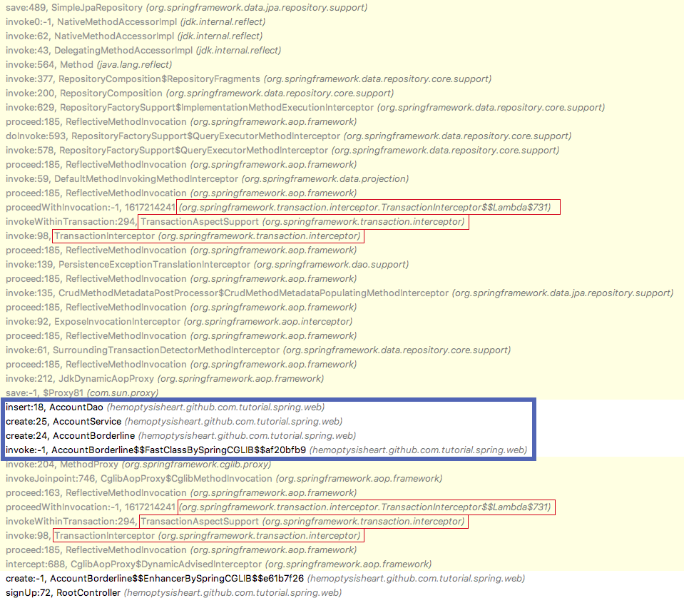

# CH.07 - 트랜잭션 관리 개선하기

## STEP 1 - 엔티티를 엔티티가 아닌 인스턴스로 변환하기

Spring Boot는 기본적으로 `@Transactional` 영역을 벗어나더라도 뷰 레이어까지 JPA 세션을 유지한다.
즉, 모델 어트리뷰트로 엔티티 인스턴스를 넘길 경우 뷰 레이어에서 렌더링이 끝날 때까지 엔티티의 DB 동기화가 유지된다는 뜻이다.

만약 템플릿에서 `AccountEntity.setPassword(String password)`를 호출한다면
렌더링이 끝나고 HTTP 리스폰스가 완료될 즈음 비밀번호 변경 쿼리를 실행한다.

비밀번호가 변경되고, 웹 세션이 종료된다면 다시 로그인 할 수 없는 상태가 된다.
이것은 데이터 오류이며, Java 코드가 아니기 때문에 코드 분석 도구의 도움을 기대하기 어렵다.

뷰 템플릿은 웹 프론트엔드에 가까운 영역이기 때문에 비지니스 로직 담당자와 다른 사람이 담당하고 있을 가능성이 높다.
따라서 문제가 발생했을 때 사람이 원인을 예측하기도 어렵다.

뷰 레이어는 어디까지나 데이터를 표현하는 방법에 대해 책임과 권한을 가진 레이어이다.
책임과 권한을 가지지 않은 곳에는 수단을 제공하지 않아야 한다.

개인적으로 다음의 기능을 담당하는 레이어를 `borderline` 이라고 부른다.

1. 트랜잭션을 시작하고
1. 비지니스 로직을 실행하고
1. 필요시 JPA 엔티티를 비 JPA 엔티티로 변환 후 반환하고
1. 트랜잭션을 종료(`commit` 혹은 `rollback`)한다.

계정 내부 로직의 시작과 종료를 담당할 `AccountBorderline`컴포넌트를 추가.

```java
package hemoptysisheart.github.com.tutorial.spring.web;

import org.springframework.beans.factory.annotation.Autowired;
import org.springframework.stereotype.Service;
import org.springframework.transaction.annotation.Transactional;

@Transactional
@Service
public class AccountBorderline {
    @Autowired
    private AccountService accountService;

    public AccountPo create(CreateAccountCmd cmd) {
        CreateAccountParams params = new CreateAccountParams(
                cmd.getEmail(),
                cmd.getNickname(),
                cmd.getPassword());
        AccountEntity account = this.accountService.create(params);
        AccountPo po = new AccountPo(
                account.getId(),
                account.getEmail(),
                account.getNickname());
        return po;
    }
}
```
[AccountBorderline.java](../../src/main/java/hemoptysisheart/github/com/tutorial/spring/web/AccountBorderline.java)

`AccountService`에 접근하던 `AccountController`를 `AccountBorderline`에 접근하도록 수정.
```java
package hemoptysisheart.github.com.tutorial.spring.web;

// ... 생략 ...

@Controller
public class RootController {
    @Autowired
    private AccountBorderline accountBorderline;

    // ... 생략 ...

    @PostMapping("/signup")
    public String signUp(@ModelAttribute("signUpReq") @Valid final SignUpReq signUpReq, final BindingResult binding, final Model model) {
        // ... 생략 ...
        if (binding.hasErrors()) {
            return "_/signup";
        } else {
            CreateAccountCmd cmd = new CreateAccountCmd(signUpReq.getEmail(), signUpReq.getNickname(), signUpReq.getPassword());
            AccountPo account = this.accountBorderline.create(cmd);
            model.addAttribute("account", account);
            return "_/newbie";
        }
    }
}
```
[RootController.java](../../src/main/java/hemoptysisheart/github/com/tutorial/spring/web/RootController.java)

`CreateAccountCmd`는 `SignUpReq`에서 검증 어노테이션과 비밀번호 검증을 제거한 클래스이다.
`SignUpReq`에서 웹 애플리케이션에 특화된 기능을 제거하고, 로직을 운영환경에서 분리할 수 있도록 기반을 만들어준다.

계정 등록의 경우, 현재 유저가 익명이기 때문에 없지만, 다른 기능의 경우 `XxxCmd` 인스턴스에 현재 사용자의 정보를 추가한다.

```java
package hemoptysisheart.github.com.tutorial.spring.web;

import static java.lang.String.format;

public class CreateAccountCmd {
    private String email;
    private String nickname;
    private String password;

    // ... 생략 ...
}
```
[CreateAccountCmd.java](../../src/main/java/hemoptysisheart/github/com/tutorial/spring/web/CreateAccountCmd.java)

`AccountPo`는 `AccountEntity`에서 JPA 엔티티 기능을 제거하고, 템플릿 등의 외부 로직에서 DB 데이터를 보호하는 기능을 한다.


```java
package hemoptysisheart.github.com.tutorial.spring.web;

import static java.lang.String.format;

public class AccountPo {
    private int id;
    private String email;
    private String nickname;

    // ... 생략 ...
}
```
[AccountPo.java](../../src/main/java/hemoptysisheart/github/com/tutorial/spring/web/AccountPo.java)

### 프로젝트 구조

```
./src/main
├── java
│   └── hemoptysisheart.github.com.tutorial.spring.web
│       ├── AccountBorderline.java
│       ├── AccountDao.java
│       ├── AccountEntity.java
│       ├── AccountPo.java
│       ├── AccountRepository.java
│       ├── AccountService.java
│       ├── ApplicationRunner.java
│       ├── CreateAccountCmd.java
│       ├── CreateAccountParams.java
│       ├── JpaConfiguration.java
│       ├── RootController.java
│       └── SignUpReq.java
└── resources
    ├── application.yml
    └── templates
        └── _
            ├── index.html
            ├── newbie.html
            └── signup.html
```
[전체 구조](step_1_tree.txt)

## STEP 2 - 오버해드 줄이기(실험적)

`@Transactional`을 사용한 컴포넌트는 프록시를 사용해 런타임에 트랜잭션 관리 기능을 추가한다. 다음의 콜 스택을 보면,


`@Transactional`이 있는 컴포넌트에 대해선 `org.springframework.transaction.interceptor`를 사용해 트랜잭션 처리 기능을 추가하고 있다.
그런데 모든 레이어에 트랜잭션 관리 기능을 넣어야 할까?

각 레이어와 컴포넌트에 `@Transactional`을 적용한 이유는
컴포넌트 단위로 단위테스트를 작성할 때 트랜잭션을 보장하기 위해서였다.

`AccountBorderline`이 트랜잭션 관리를 시작하고 그 안에 있기 때문에,
서비스나 DAO 레이어에서 트랜잭션을 관리할 필요가 없다.
`AccountService`와 `AccountDao`에서 `@Transactional` 어노테이션을 제거해서
오버해드를 제거한다.



16단계의 콜스택이 사라졌고, 스크린샷에 찍힌 메서드 호출 앞뒤로 있을 다른 로직의 오버해드도 사라졌다.
부수적인 효과로 각 레이어 사이(`AccountBorderline` -> `AccountService` 등)의 프록시가 사라지고 직접 호출하면서 디버깅도 편해졌다.

이렇게 내부 레이어에서 `@Transactional`을 제거해 오버해드를 줄이는 방식은 _**사용해본 적이 없다**_.

그리고, 트랜잭션 매니저가 1개인 애플리케이션에서만 사용할 수 있을 것으로 _**추정한다**_.