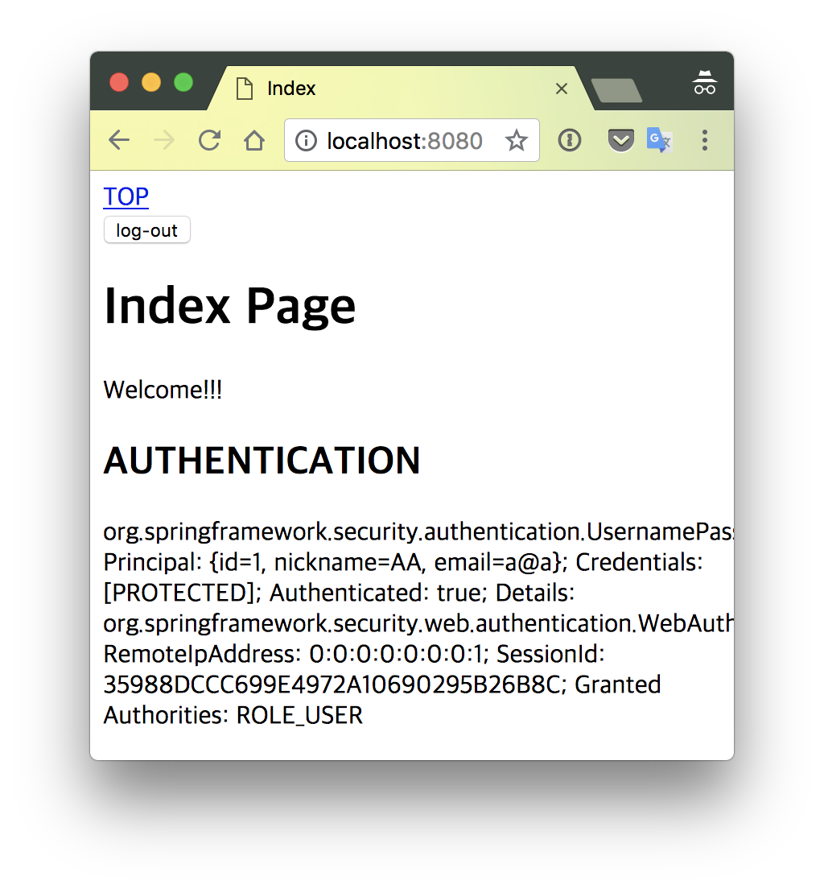

# CH.10 - 인증

회원가입(계정 등록)은 만들었다.
인증을 추가해 로그인 기반의 웹 애플리케이션으로 전환한다.

> * 인증(Authentication) : 로그인.
> * 인가(Authorize) : 현재 유저가 어떤 유저인가. 게스트/일반/관리자 등.

## STEP 1 - 시큐리티 모듈

### 라이브러리 추가

먼저 Spring Security 모듈을 추가한다.

```xml
<dependency>
    <groupId>org.springframework.boot</groupId>
    <artifactId>spring-boot-starter-security</artifactId>
</dependency>
```
[pom.xml](../../pom.xml)


### `AccountDetails` - 웹 세션용 타입 정의

서블릿 컨테이너의 웹 세션에서 `Account` 정보를 저장, 공유할 때 사용할 데이터 타입을 정의.

웹 세션 정보는 애플리케이션의 메모리에 저장하거나 별도의 세션 서버에 저장해서 다수의 애플리케이션 서버가 공유한다.
즉, JVM 메모리에서 트랜잭션 관리 등에 사용하는 JPA 엔티티(`AccountEntity`)는 사용할 수 없다.
따라서 JPA에서 자유로운 별도의 타입을 정의해 그 인스턴스를 사용해야 한다.

```java
package hemoptysisheart.github.com.tutorial.spring.web.security;

// ... 생략 ...

public interface AccountDetails extends UserDetails {
    int getId();

    String getEmail();

    String getNickname();

    // ... 생략 ...
}
```
[AccountDetails.java](../../src/main/java/hemoptysisheart/github/com/tutorial/spring/web/security/AccountDetails.java)

세션이 생성되고 인증로직이 실행되면 세션에 계정 정보가 저장된다.
데이터가 이상 없이 설정되도록 검증 로직을 넣어준다.

```java
package hemoptysisheart.github.com.tutorial.spring.web.security;

// ... 생략 ...

public class BasicAccountDetails implements AccountDetails {
    private int id;
    private String nickname;
    private String email;
    private String password;

    public BasicAccountDetails(int id, String nickname, String email, String password) {
        if (0 >= id) {
            throw new IllegalArgumentException(format("illegal account id : %d", id));
        }
        if (null == nickname || nickname.isEmpty()) {
            throw new IllegalArgumentException(format("illegal account nickname : %s", nickname));
        }
        if (null == email || email.isEmpty()) {
            throw new IllegalArgumentException(format("illegal account email : %s", email));
        }
        if (null == password || password.isEmpty()) {
            throw new IllegalArgumentException("illegal account password hash : [ PROTECTED ]");
        }

        this.id = id;
        this.nickname = nickname;
        this.email = email;
        this.password = password;
    }

    // ... 생략 ...
}
```
[BasicAccountDetails.java](../../src/main/java/hemoptysisheart/github/com/tutorial/spring/web/security/BasicAccountDetails.java)

### `AccountDetailsService` - 인증용 계정 정보 로더

Spring Security는 로그인 할 때 유저 정보(`UserDetails`)를 읽기 위해 `UserDetialsService`를 사용한다.
애플리케이션에 특화된 유저 정보를 읽기 위해 `AccountDetailsService`를 정의하고 구현한다.

```java
package hemoptysisheart.github.com.tutorial.spring.web.security;

// ... 생략 ...

@Transactional
public interface AccountDetailsService extends UserDetailsService {
    @Override
    AccountDetails loadUserByUsername(String username) throws UsernameNotFoundException;
}
```
[AccountDetailsService.java](../../src/main/java/hemoptysisheart/github/com/tutorial/spring/web/security/AccountDetailsService.java)

계정마다 유일한 속성이 `nickname`과 `email`의 2가지가 있으므로 이 두가지 값을 로그인 키로 사용할 수 있다.
사용량 통계를 통해 `nickname`을 많이 쓰는지, `email`을 많이 쓰는지 확인해 많이 쓰는 속성을 먼저 확인하도록 하는 방식으로 DB 부하를 낮출 수 있다.
만약, 최근 통계를 실시간으로 획득할 수 있다면 최근 통계를 바탕으로 자동 선택하도록 만들 수도 있다.

```java
package hemoptysisheart.github.com.tutorial.spring.web.security;

// ... 생략 ...

@Service
class AccountDetailsServiceImpl implements AccountDetailsService {
    @Autowired
    private AccountDao accountDao;

    @Override
    public AccountDetails loadUserByUsername(String username) throws UsernameNotFoundException {
        Account account = this.accountDao.select(username);
        if (null == account) {
            account = this.accountDao.selectWhereEmail(username);
        }

        if (null == account) {
            throw new UsernameNotFoundException(format("account does not exist : username=%s", username));
        }

        AccountDetails details = new BasicAccountDetails(
                account.getId(),
                account.getNickname(),
                account.getEmail(),
                account.getPassword()
        );

        return details;
    }
}
```
[AccountDetailsServiceImpl.java](../../src/main/java/hemoptysisheart/github/com/tutorial/spring/web/security/AccountDetailsServiceImpl.java)

### 애플리케이션 설정

설정 파일을 추가하고 Spring Security를 활성화한다.

```java
package hemoptysisheart.github.com.tutorial.spring.web.configuration;

// ... 생략 ...

@Configuration
@EnableWebSecurity
public class WebSecurityConfiguration extends WebSecurityConfigurerAdapter {
    // ... 생략 ...
}
```
[WebSecurityConfiguration.java](../../src/main/java/hemoptysisheart/github/com/tutorial/spring/web/configuration/WebSecurityConfiguration.java)

Spring Security의 기본 비밀번호 암호화 컴포넌트(단방향)인 `BCryptPasswordEncoder` 인스턴스를 생성, 등록한다.

```java
@Bean
public PasswordEncoder passwordEncoder() {
    return new BCryptPasswordEncoder();
}
```
[passwordEncoder()](../../src/main/java/hemoptysisheart/github/com/tutorial/spring/web/configuration/WebSecurityConfiguration.java#L33)

로그인 할 때 [`AccountDetailsService`](../../src/main/java/hemoptysisheart/github/com/tutorial/spring/web/security/AccountDetailsService.java) 인스턴스로 인증 정보를 읽어오고
`BCryptPasswordEncoder`로 비밀번호를 비교 하도록 설정한다.

```java
@Override
protected void configure(AuthenticationManagerBuilder auth) throws Exception {
    auth.userDetailsService(this.accountDetailsService)
            .passwordEncoder(passwordEncoder());
}
```
[configure(AuthenticationManagerBuilder auth)](../../src/main/java/hemoptysisheart/github/com/tutorial/spring/web/configuration/WebSecurityConfiguration.java#L42)

게스트로 회원가입, 로그인 페이지에 접속할 수 있도록 페이지를 설정한다.

```java
@Override
protected void configure(HttpSecurity http) throws Exception {
    http.formLogin();
    http.logout();
    http.authorizeRequests()
            .antMatchers("/").permitAll()
            .antMatchers("/signup", "/login", "/login/**").anonymous();
}
```
[configure(HttpSecurity http)](../../src/main/java/hemoptysisheart/github/com/tutorial/spring/web/configuration/WebSecurityConfiguration.java#L48)

마지막으로, 로그인 할 때 `PasswordEncoder`를 사용해 비밀번호를 비교할 수 있도록
계정을 등록할 때 해시한 비밀번호를 저장하도록 계정 등록 로직을 수정한다.

> DB에 저장하는 비밀번호가 평문에서 해시(단방향 암호화)로 바뀌기 때문에, 기존 데이터를 삭제하고 새로 등록해야 한다.

```java
package hemoptysisheart.github.com.tutorial.spring.web.service;

// ... 생략 ...

@Service
class AccountServiceImpl implements AccountService {
    // ... 생략 ...

    @Autowired
    private PasswordEncoder passwordEncoder;

    @Override
    public Account create(CreateAccountParams params) {
        // ... 생략 ...

        Account account = new AccountEntity(params.getEmail(), params.getNickname(),
                passwordEncoder.encode(params.getPassword()));

        // ... 생략 ...
        return account;
    }
}
```
[AccountServiceImpl.java](../../src/main/java/hemoptysisheart/github/com/tutorial/spring/web/service/AccountServiceImpl.java)

## 로그인 상태에 따른 UI 선택

게스트일 땐 계정 등록 혹은 로그인 페이지로 갈 수 있는 GNB(Global Navigation Bar)를 보이고,
로그인 한 후에는 로그안웃 혹은 기타 기능을 사용할 수 있는 메뉴를 보여준다.

```xml
<dependency>
    <groupId>org.thymeleaf.extras</groupId>
    <artifactId>thymeleaf-extras-springsecurity4</artifactId>
</dependency>
```
[pom.xml](../../pom.xml#L60)

루트 패스(`/`)의 템플릿을 수정한다.

* `sec:authorize="anonymous"` : 로그인 하지 않은 경우의 GNB.
* `sec:authorize="authenticated"` : 로그인 한 경우의 GNB.

```html
<html xmlns:th="http://www.thymeleaf.org"
      xmlns:sec="http://www.thymeleaf.org/extras/spring-security">
<!-- 생략 -->
<header>
    <nav sec:authorize="anonymous">
        <a href="index.html" th:href="@{/}">TOP</a>
        <a href="signup.html" th:href="@{/signup}">sign-up</a>
        <a href="login.html" th:href="@{/login}">log-in</a>
    </nav>
    <nav sec:authorize="authenticated">
        <a href="index.html" th:href="@{/}">TOP</a>
        <form action="index.html" method="post" th:action="@{/logout}">
            <button>log-out</button>
        </form>
    </nav>
</header>
<!-- 생략 -->
```
[index.html](../../templates/_/index.html)




> [`_/signup.html`](../../templates/_/signup.html)과 [`_/newbie.html`](../../templates/_/newbie.html) 템플릿의 경우,
> 사용하는 경우가 고정되어 있기 때문에 [`_/index.html`](../../templates/_/index.html)와 달리
> 분기를 추가하지 않음.
