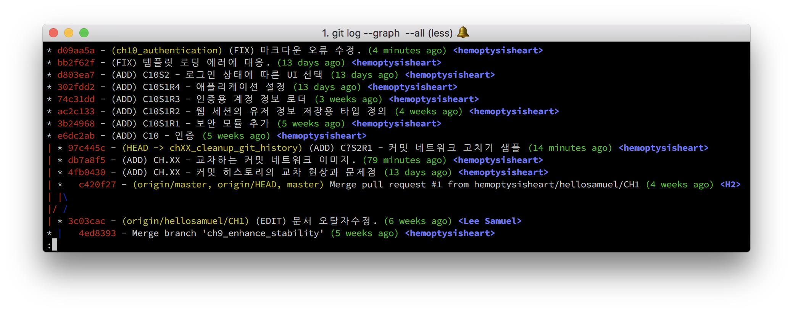
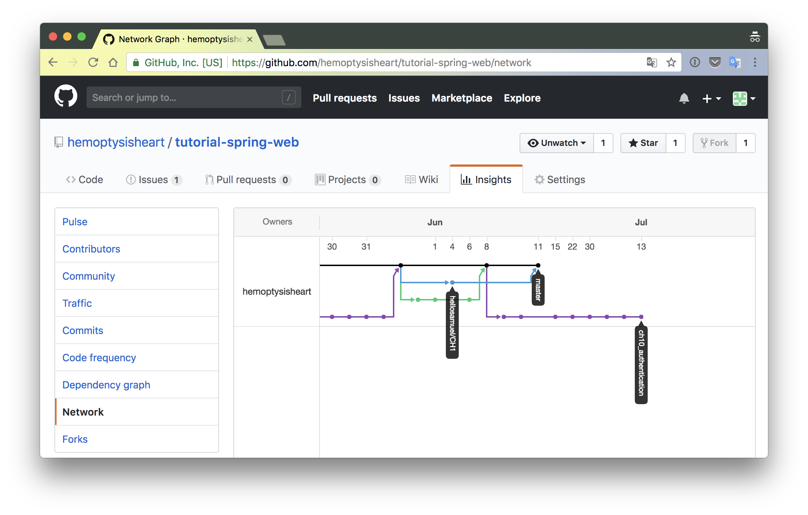
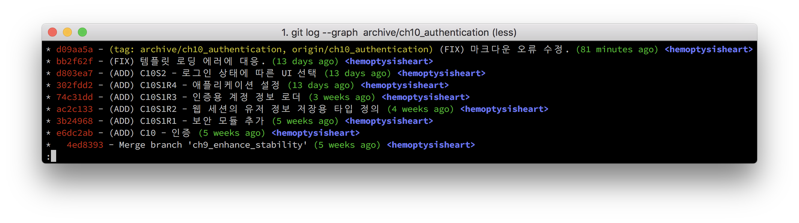
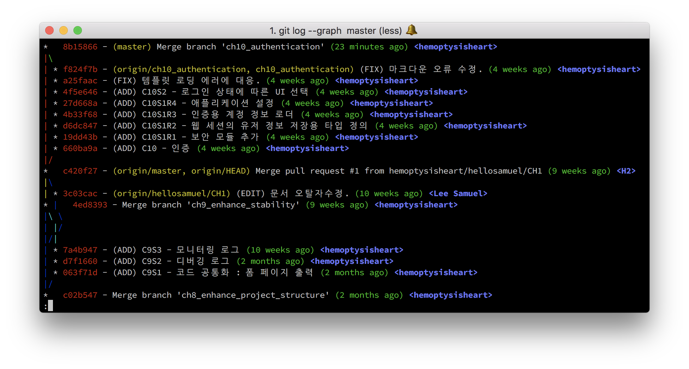

# CH.XX - Git 히스토리 정리

## STEP 1 - 커밋 네트워크의 교차 현상

### 현상

프로젝트 저장소에 다음 순서로 작업이 발생했다.

1. `master` 브랜치가 c02b5479d862eabb3bc1ce0157f36d1c888f75b4 커밋일 때
[CH.09 - 안정성 개선](../09/readme.md)의 `ch9_enhance_stablility` 브랜치가 작업을 시작.
1. `master` 브랜치가 동일하게 c02b5479d862eabb3bc1ce0157f36d1c888f75b4 커밋일 때
수정사항 [`CH1`](/hellosamuel/tutorial-spring-web/tree/CH1)이 발생.
1. [`CH1`](/hellosamuel/tutorial-spring-web/tree/CH1)에서 [Pull Request #1](/hemoptysisheart/tutorial-spring-web/pull/1)가 생성.
1. [CH.09 - 안정성 개선](../09/readme.md)의 `ch9_enhance_stablility` 브랜치가 작업을 끝내고 저장소에 반영.
1. [Pull Request #1](/hemoptysisheart/tutorial-spring-web/pull/1)가 병합.

그 결과 Git 커밋 히스토리에 교차 현상(L.5 ~ 6)이 나타난다.

```
00 *   c420f27 - (HEAD -> chXX_cleanup_git_history, origin/master, origin/HEAD) Merge pull request #1 from hemoptysisheart/hellosamuel/CH1 (3 weeks ago) <H2>
01 |\
02 | * 3c03cac - (origin/hellosamuel/CH1) (EDIT) 문서 오탈자수정. (4 weeks ago) <Lee Samuel>
03 * |   4ed8393 - Merge branch 'ch9_enhance_stability' (3 weeks ago) <hemoptysisheart>
04 |\ \
05 | |/
06 |/|
07 | * 7a4b947 - (ADD) C9S3 - 모니터링 로그 (3 weeks ago) <hemoptysisheart>
08 | * d7f1660 - (ADD) C9S2 - 디버깅 로그 (4 weeks ago) <hemoptysisheart>
09 | * 063f71d - (ADD) C9S1 - 코드 공통화 : 폼 페이지 출력 (4 weeks ago) <hemoptysisheart>
10 |/
11 *   c02b547 - Merge branch 'ch8_enhance_project_structure' (4 weeks ago) <hemoptysisheart>
```


커맨드라인에서 확인하는 커밋 네트워크는 알아보기가 좀 힘들다. 깃허브에서 제공하는 [커밋 네트워크](/hemoptysisheart/tutorial-spring-web/network)에서 확인하면,


풀리퀘스트를 병합하기 전에 하나의 커밋에서 두 브랜치가 가지를 쳐서 나오고, 그 중 하나가 먼저 작업을 끝내고 `master` 브랜치에 병합된 것을 확인할 수 있다.

그리고 풀리퀘스트를 그대로 병합하면


이렇게 커밋 네트워크가 교차한다.
커밋 네트워크를 그리는 방식에 따라선 교차하지 않도록 만들 수도 있긴 하지만, 커밋 네트워크의 폭은 3가닥으로, 줄어들지 않는다.

### 문제점

1. 커밋 히스토리의 교차 현상은 현재의 브랜치/커밋의 **변경이력을 읽기 어렵게 만드는 주요 원인**이다.
1. 커밋 네트워크에서 동시에 그려지는 가닥은 **동시에 고려해야 하는 범위**이다.
1. 동시에 과거의 커밋을 기준으로 작성한 변경은 **충돌의 주요 원인**이다.

### 방지 원칙

1. 작업은 기준 브랜치(이 경우 `master`)의 현재 커밋에서 시작한다.
1. 기준 브랜치의 현재 커밋을 가지지 않은 작업은 병합하지 않는다.

## STEP 2 - 교차하지 않도록 정리하기

### 문제 있는 지금 상태

마침 이대로 병합하면 네트워크가 교차하고, 네트워크를 그리는 순서를 바꾼다 해도 교차를 없앨 수 없는 브랜치가 있다. 바로 03번 줄에 있는 bb2f62f5f67f90ccb68330fdaad77c9004e2a394 커밋을 가진 `ch10_authentication` 브랜치이다.

1. 4ed8393bb9bd11ccf2d73529ee516a2ba246657e 커밋에서 `ch10_authentication` 브랜치를 작성, 작업 시작.
1. [`CH1`](/hellosamuel/tutorial-spring-web/tree/CH1)에서 [Pull Request #1](/hemoptysisheart/tutorial-spring-web/pull/1)가 생성.
1. [Pull Request #1](/hemoptysisheart/tutorial-spring-web/pull/1)이 `master` 브랜치에 병합.
1. `ch10_authentication` 브랜치가 작업을 끝내고 d09aa5a604363a025c072ed039654cf6181fbc7b 커밋에서 병합해야 하는 상태가 됨.

```
00 * d09aa5a - (ch10_authentication) (FIX) 마크다운 오류 수정. (4 minutes ago) <hemoptysisheart>
01 * bb2f62f - (FIX) 템플릿 로딩 에러에 대응. (13 days ago) <hemoptysisheart>
02 * d803ea7 - (ADD) C10S2 - 로그인 상태에 따른 UI 선택 (13 days ago) <hemoptysisheart>
03 * 302fdd2 - (ADD) C10S1R4 - 애플리케이션 설정 (13 days ago) <hemoptysisheart>
04 * 74c31dd - (ADD) C10S1R3 - 인증용 계정 정보 로더 (3 weeks ago) <hemoptysisheart>
05 * ac2c133 - (ADD) C10S1R2 - 웹 세션의 유저 정보 저장용 타입 정의 (4 weeks ago) <hemoptysisheart>
06 * 3b24968 - (ADD) C10S1R1 - 보안 모듈 추가 (5 weeks ago) <hemoptysisheart>
07 * e6dc2ab - (ADD) C10 - 인증 (5 weeks ago) <hemoptysisheart>
08 | * 97c445c - (HEAD -> chXX_cleanup_git_history) (ADD) C?S2R1 - 커밋 네트워크 고치기 샘플 (14 minutes ago) <hemoptysisheart>
09 | * db7a8f5 - (ADD) CH.XX - 교차하는 커밋 네트워크 이미지. (79 minutes ago) <hemoptysisheart>
10 | * 4fb0430 - (ADD) CH.XX - 커밋 히스토리의 교차 현상과 문제점 (13 days ago) <hemoptysisheart>
11 | *   c420f27 - (origin/master, origin/HEAD, master) Merge pull request #1 from hemoptysisheart/hellosamuel/CH1 (4 weeks ago) <H2>
12 | |\
13 |/ /
14 | * 3c03cac - (origin/hellosamuel/CH1) (EDIT) 문서 오탈자수정. (6 weeks ago) <Lee Samuel>
15 * |   4ed8393 - Merge branch 'ch9_enhance_stability' (5 weeks ago) <hemoptysisheart>
```


이대로는 알아보기가 어려우니 `origin` 저장소(GitHub)에 푸시하고 [커밋 네트워크](/hemoptysisheart/tutorial-spring-web/network)에서 확인하면,



꼬일 수 밖에 없는 커밋 네트워크를 쉽게 확인할 수 있다.

임시 브랜치 `chXX_dummy`를 만들어 확인해보자. 12~13번 줄에서 꼬이는 걸 확인할 수 있다.

```
00 *   312dd8c - (chXX_dummy) Merge branch 'ch10_authentication' into chXX_dummy (7 minutes ago) <hemoptysisheart>
01 |\
02 | * d09aa5a - (origin/ch10_authentication, ch10_authentication) (FIX) 마크다운 오류 수정. (31 minutes ago) <hemoptysisheart>
03 | * bb2f62f - (FIX) 템플릿 로딩 에러에 대응. (13 days ago) <hemoptysisheart>
04 | * d803ea7 - (ADD) C10S2 - 로그인 상태에 따른 UI 선택 (13 days ago) <hemoptysisheart>
05 | * 302fdd2 - (ADD) C10S1R4 - 애플리케이션 설정 (13 days ago) <hemoptysisheart>
06 | * 74c31dd - (ADD) C10S1R3 - 인증용 계정 정보 로더 (3 weeks ago) <hemoptysisheart>
07 | * ac2c133 - (ADD) C10S1R2 - 웹 세션의 유저 정보 저장용 타입 정의 (4 weeks ago) <hemoptysisheart>
08 | * 3b24968 - (ADD) C10S1R1 - 보안 모듈 추가 (5 weeks ago) <hemoptysisheart>
09 | * e6dc2ab - (ADD) C10 - 인증 (5 weeks ago) <hemoptysisheart>
10 * |   c420f27 - (origin/master, origin/HEAD, master) Merge pull request #1 from hemoptysisheart/hellosamuel/CH1 (5 weeks ago) <H2>
11 |\ \
12 | |/
13 |/|
14 | * 3c03cac - (origin/hellosamuel/CH1) (EDIT) 문서 오탈자수정. (6 weeks ago) <Lee Samuel>
15 * |   4ed8393 - Merge branch 'ch9_enhance_stability' (5 weeks ago) <hemoptysisheart>
```


> 보기 싫으니 GitHub의 임시 브랜치를 삭제하자.
> ```
> ➜  tutorial-spring-web git:(chXX_cleanup_git_history) ✗ git push origin :chXX_dummy
> To hemoptysisheart.github.com:hemoptysisheart/tutorial-spring-web.git
>  - [deleted]         chXX_dummy
> ```

### 고치기

고치기 전에 지금의 `ch10_authentication` 브랜치 상태를 기록하기 위해 태그를 만들어둔다.

```
* d09aa5a - (tag: archive/ch10_authentication, origin/ch10_authentication, ch10_authentication) (FIX) 마크다운 오류 수정. (59 minutes ago) <hemoptysisheart>
... 생략 ...
```

> ```
> ✗ git tag archive/ch10_authentication
> ```

`ch10_authentication` 브랜치를 `master` 브랜치를 기준으로 리베이스 한다.
최신 `master`에서 브랜치를 만든 것 처럼 바뀐다.

```
➜  tutorial-spring-web git:(ch10_authentication) git rebase master
First, rewinding head to replay your work on top of it...
Applying: (ADD) C10 - 인증
Applying: (ADD) C10S1R1 - 보안 모듈 추가
Applying: (ADD) C10S1R2 - 웹 세션의 유저 정보 저장용 타입 정의
Applying: (ADD) C10S1R3 - 인증용 계정 정보 로더
Applying: (ADD) C10S1R4 - 애플리케이션 설정
Applying: (ADD) C10S2 - 로그인 상태에 따른 UI 선택
Applying: (FIX) 템플릿 로딩 에러에 대응.
Applying: (FIX) 마크다운 오류 수정.
```

리베이스를 하면 기존 브랜치(`master`)에 없는 커밋을 다시 실행하면서 커밋 메시지를 보여준다.
그래서 `ch10_authentication` 브랜치에서 작업한 8개의 커밋에서 바뀐 내용을 다시 커밋한다.

그 결과를 비교해보면 다음과 같다.

<table>
    <thead>
        <tr>
            <th><code>ch10_authentication</code></th>
            <th><code>archive/ch10_authentication</code>(원본)</th>
        </tr>
    <thead>
    <tbody>
        <tr>
            <td>
                <ul>
                    <li>L.00 <code>d09aa5a</code> - (tag: archive/ch10_authentication) (FIX) 마크다운 오류 수정. (68 minutes ago) &lt;hemoptysisheart&gt;</li>
                    <li>L.01 <code>bb2f62f</code> - (FIX) 템플릿 로딩 에러에 대응. (13 days ago) &lt;hemoptysisheart&gt;</li>
                    <li>L.02 <code>d803ea7</code> - (ADD) C10S2 - 로그인 상태에 따른 UI 선택 (13 days ago) &lt;hemoptysisheart&gt;</li>
                    <li>L.03 <code>302fdd2</code> - (ADD) C10S1R4 - 애플리케이션 설정 (13 days ago) &lt;hemoptysisheart&gt;</li>
                    <li>L.04 <code>74c31dd</code> - (ADD) C10S1R3 - 인증용 계정 정보 로더 (3 weeks ago) &lt;hemoptysisheart&gt;</li>
                    <li>L.05 <code>ac2c133</code> - (ADD) C10S1R2 - 웹 세션의 유저 정보 저장용 타입 정의 (4 weeks ago) &lt;hemoptysisheart&gt;</li>
                    <li>L.06 <code>3b24968</code> - (ADD) C10S1R1 - 보안 모듈 추가 (5 weeks ago) &lt;hemoptysisheart&gt;</li>
                    <li>L.07 <code>e6dc2ab</code> - (ADD) C10 - 인증 (5 weeks ago) &lt;hemoptysisheart&gt;</li>
                </ul>
            </td>
            <td>
                <ul>
                    <li>L.16 <code>f824f7b</code> - (ch10_authentication) (FIX) 마크다운 오류 수정. (6 minutes ago) &lt;hemoptysisheart&gt;</li>
                    <li>L.17 <code>a25faac</code> - (FIX) 템플릿 로딩 에러에 대응. (6 minutes ago) &lt;hemoptysisheart&gt;</li>
                    <li>L.18 <code>4f5e646</code> - (ADD) C10S2 - 로그인 상태에 따른 UI 선택 (6 minutes ago) &lt;hemoptysisheart&gt;</li>
                    <li>L.19 <code>27d668a</code> - (ADD) C10S1R4 - 애플리케이션 설정 (6 minutes ago) &lt;hemoptysisheart&gt;</li>
                    <li>L.20 <code>4b33f68</code> - (ADD) C10S1R3 - 인증용 계정 정보 로더 (6 minutes ago) &lt;hemoptysisheart&gt;</li>
                    <li>L.21 <code>d6dc847</code> - (ADD) C10S1R2 - 웹 세션의 유저 정보 저장용 타입 정의 (6 minutes ago) &lt;hemoptysisheart&gt;</li>
                    <li>L.22 <code>19dd43b</code> - (ADD) C10S1R1 - 보안 모듈 추가 (6 minutes ago) &lt;hemoptysisheart&gt;</li>
                    <li>L.23 <code>660ba9a</code> - (ADD) C10 - 인증 (6 minutes ago) &lt;hemoptysisheart&gt;</li>
                </ul>
            </td>
        </tr>
        <tr>
            <td></td>
            <td></td>
        </tr>
    </tbody>
</table>


```
00 * f824f7b - (ch10_authentication) (FIX) 마크다운 오류 수정. (43 minutes ago) <hemoptysisheart>
01 * a25faac - (FIX) 템플릿 로딩 에러에 대응. (43 minutes ago) <hemoptysisheart>
02 * 4f5e646 - (ADD) C10S2 - 로그인 상태에 따른 UI 선택 (43 minutes ago) <hemoptysisheart>
03 * 27d668a - (ADD) C10S1R4 - 애플리케이션 설정 (43 minutes ago) <hemoptysisheart>
04 * 4b33f68 - (ADD) C10S1R3 - 인증용 계정 정보 로더 (43 minutes ago) <hemoptysisheart>
05 * d6dc847 - (ADD) C10S1R2 - 웹 세션의 유저 정보 저장용 타입 정의 (43 minutes ago) <hemoptysisheart>
06 * 19dd43b - (ADD) C10S1R1 - 보안 모듈 추가 (43 minutes ago) <hemoptysisheart>
07 * 660ba9a - (ADD) C10 - 인증 (43 minutes ago) <hemoptysisheart>
08 | * a9d21b8 - (HEAD -> chXX_cleanup_git_history) (ADD) C?S2R2 - 커밋 네트워크가 꼬이는 현상 확인하기. (65 minutes ago) <hemoptysisheart>
09 | * 343f3d8 - (ADD) C?S2R1 - 커밋 네트워크 고치기 샘플 (2 hours ago) <hemoptysisheart>
10 | * db7a8f5 - (ADD) CH.XX - 교차하는 커밋 네트워크 이미지. (3 hours ago) <hemoptysisheart>
11 | * 4fb0430 - (ADD) CH.XX - 커밋 히스토리의 교차 현상과 문제점 (13 days ago) <hemoptysisheart>
12 |/
13 *   c420f27 - (origin/master, origin/HEAD, master) Merge pull request #1 from hemoptysisheart/hellosamuel/CH1 (5 weeks ago) <H2>
14 |\
15 | * 3c03cac - (origin/hellosamuel/CH1) (EDIT) 문서 오탈자수정. (6 weeks ago) <Lee Samuel>
16 | | * d09aa5a - (tag: archive/ch10_authentication, origin/ch10_authentication) (FIX) 마크다운 오류 수정. (2 hours ago) <hemoptysisheart>
17 | | * bb2f62f - (FIX) 템플릿 로딩 에러에 대응. (13 days ago) <hemoptysisheart>
18 | | * d803ea7 - (ADD) C10S2 - 로그인 상태에 따른 UI 선택 (13 days ago) <hemoptysisheart>
19 | | * 302fdd2 - (ADD) C10S1R4 - 애플리케이션 설정 (13 days ago) <hemoptysisheart>
20 | | * 74c31dd - (ADD) C10S1R3 - 인증용 계정 정보 로더 (3 weeks ago) <hemoptysisheart>
21 | | * ac2c133 - (ADD) C10S1R2 - 웹 세션의 유저 정보 저장용 타입 정의 (4 weeks ago) <hemoptysisheart>
22 | | * 3b24968 - (ADD) C10S1R1 - 보안 모듈 추가 (5 weeks ago) <hemoptysisheart>
23 | | * e6dc2ab - (ADD) C10 - 인증 (5 weeks ago) <hemoptysisheart>
24 | |/
25 |/|
26 * |   4ed8393 - Merge branch 'ch9_enhance_stability' (5 weeks ago) <hemoptysisheart>
```


## STEP 3 - 정리한 커밋 네트워크 반영하기

이렇게 정리된 커밋을 `master`에 반영한다.

```
➜  tutorial-spring-web git:(ch10_authentication) git checkout master
Switched to branch 'master'
Your branch is up to date with 'origin/master'.
➜  tutorial-spring-web git:(master) git merge --no-ff ch10_authentication
Merge made by the 'recursive' strategy.
 config/application.yml                                                                                   |   1 +
 doc/10/readme.md                                                                                         | 272 +++++++++++++++++++++++++++++++++++++++++++++++++++++++++++++++++++++++++++++++++++++++++++++++++++++++++++++++++++++++++++++
 doc/10/step_1_login_by_email.log                                                                         |   7 ++++
 doc/10/step_1_login_by_nickname.log                                                                      |   6 +++
 doc/10/step_2_root_path_guest.png                                                                        | Bin 0 -> 245734 bytes
 doc/10/step_2_root_path_login_user.png                                                                   | Bin 0 -> 242048 bytes
 doc/readme.md                                                                                            |   3 +-
 pom.xml                                                                                                  |   8 ++++
 src/main/java/hemoptysisheart/github/com/tutorial/spring/web/configuration/WebSecurityConfiguration.java |  56 ++++++++++++++++++++++++++
 src/main/java/hemoptysisheart/github/com/tutorial/spring/web/dao/AccountDao.java                         |  32 +++++++++++++++
 src/main/java/hemoptysisheart/github/com/tutorial/spring/web/dao/AccountDaoImpl.java                     |  28 +++++++++++++
 src/main/java/hemoptysisheart/github/com/tutorial/spring/web/security/AccountDetails.java                |  89 +++++++++++++++++++++++++++++++++++++++++
 src/main/java/hemoptysisheart/github/com/tutorial/spring/web/security/AccountDetailsService.java         |  33 ++++++++++++++++
 src/main/java/hemoptysisheart/github/com/tutorial/spring/web/security/AccountDetailsServiceImpl.java     |  70 ++++++++++++++++++++++++++++++++
 src/main/java/hemoptysisheart/github/com/tutorial/spring/web/security/BasicAccountDetails.java           |  65 ++++++++++++++++++++++++++++++
 src/main/java/hemoptysisheart/github/com/tutorial/spring/web/security/SecurityConfiguration.java         |  10 +++++
 src/main/java/hemoptysisheart/github/com/tutorial/spring/web/service/AccountServiceImpl.java             |   6 ++-
 templates/_/index.html                                                                                   |  38 +++++++++++++++++-
 templates/_/newbie.html                                                                                  |   1 +
 templates/_/signup.html                                                                                  |   1 +
 20 files changed, 722 insertions(+), 4 deletions(-)
 create mode 100644 doc/10/readme.md
 create mode 100644 doc/10/step_1_login_by_email.log
 create mode 100644 doc/10/step_1_login_by_nickname.log
 create mode 100644 doc/10/step_2_root_path_guest.png
 create mode 100644 doc/10/step_2_root_path_login_user.png
 create mode 100644 src/main/java/hemoptysisheart/github/com/tutorial/spring/web/configuration/WebSecurityConfiguration.java
 create mode 100644 src/main/java/hemoptysisheart/github/com/tutorial/spring/web/security/AccountDetails.java
 create mode 100644 src/main/java/hemoptysisheart/github/com/tutorial/spring/web/security/AccountDetailsService.java
 create mode 100644 src/main/java/hemoptysisheart/github/com/tutorial/spring/web/security/AccountDetailsServiceImpl.java
 create mode 100644 src/main/java/hemoptysisheart/github/com/tutorial/spring/web/security/BasicAccountDetails.java
 create mode 100644 src/main/java/hemoptysisheart/github/com/tutorial/spring/web/security/SecurityConfiguration.java
 ```

> ```
> git checkout master
> git merge --no-ff ch10_authentication
> ```

다음과 같은 커밋 네트워크로 정리된다.

```
*   8b15866 - (master) Merge branch 'ch10_authentication' (19 minutes ago) <hemoptysisheart>
|\
| * f824f7b - (origin/ch10_authentication, ch10_authentication) (FIX) 마크다운 오류 수정. (4 weeks ago) <hemoptysisheart>
| * a25faac - (FIX) 템플릿 로딩 에러에 대응. (4 weeks ago) <hemoptysisheart>
| * 4f5e646 - (ADD) C10S2 - 로그인 상태에 따른 UI 선택 (4 weeks ago) <hemoptysisheart>
| * 27d668a - (ADD) C10S1R4 - 애플리케이션 설정 (4 weeks ago) <hemoptysisheart>
| * 4b33f68 - (ADD) C10S1R3 - 인증용 계정 정보 로더 (4 weeks ago) <hemoptysisheart>
| * d6dc847 - (ADD) C10S1R2 - 웹 세션의 유저 정보 저장용 타입 정의 (4 weeks ago) <hemoptysisheart>
| * 19dd43b - (ADD) C10S1R1 - 보안 모듈 추가 (4 weeks ago) <hemoptysisheart>
| * 660ba9a - (ADD) C10 - 인증 (4 weeks ago) <hemoptysisheart>
|/
*   c420f27 - (origin/master, origin/HEAD) Merge pull request #1 from hemoptysisheart/hellosamuel/CH1 (9 weeks ago) <H2>
```

커밋 네트워크를 정리하지 않은 채 병함한 경우와 달리 커밋 네트워크가 교차하지 않는다.

이번은 두 개의 브랜치에서 한 작업을 반영했기 때문에 한 번의 교차만 일어나고,
병합 커밋을 포함해 각 커밋도 각 브랜치 분량이 따로 생성되었다.

하지만 작업자가 늘어나고 작업 브랜치도 늘어날 경우,
커밋 네트워크는 매우 복잡해지며 어떤 작업이 어떤 과정을 거쳐 프로그램에 반영되었는지 그 과정을 알기 어렵게 된다.

각각의 작업이 언제 어떻게 진해됐는지는 별도의 프로젝트 관리 프로그램의 간트 차트 등을 이용하고,
커밋 네트워크는 시간 문제는 제외하고 변화의 선후 관계를 보는 도구로 사용해야 한다.

```
*   c420f27 - (origin/master, origin/HEAD) Merge pull request #1 from hemoptysisheart/hellosamuel/CH1 (9 weeks ago) <H2>
|\
| * 3c03cac - (origin/hellosamuel/CH1) (EDIT) 문서 오탈자수정. (10 weeks ago) <Lee Samuel>
* |   4ed8393 - Merge branch 'ch9_enhance_stability' (9 weeks ago) <hemoptysisheart>
|\ \
| |/
|/|
| * 7a4b947 - (ADD) C9S3 - 모니터링 로그 (10 weeks ago) <hemoptysisheart>
| * d7f1660 - (ADD) C9S2 - 디버깅 로그 (2 months ago) <hemoptysisheart>
| * 063f71d - (ADD) C9S1 - 코드 공통화 : 폼 페이지 출력 (2 months ago) <hemoptysisheart>
|/
*   c02b547 - Merge branch 'ch8_enhance_project_structure' (2 months ago) <hemoptysisheart>
```


