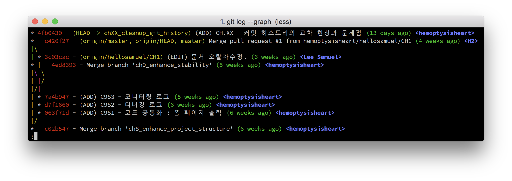
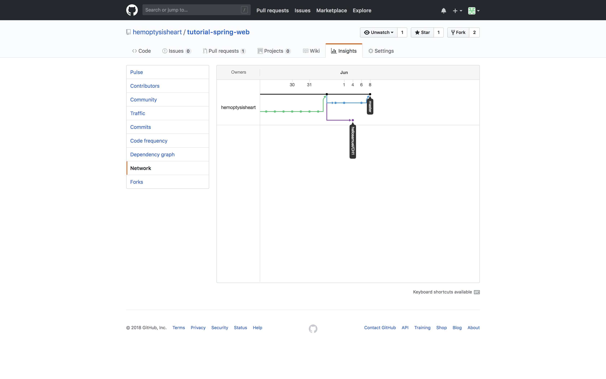
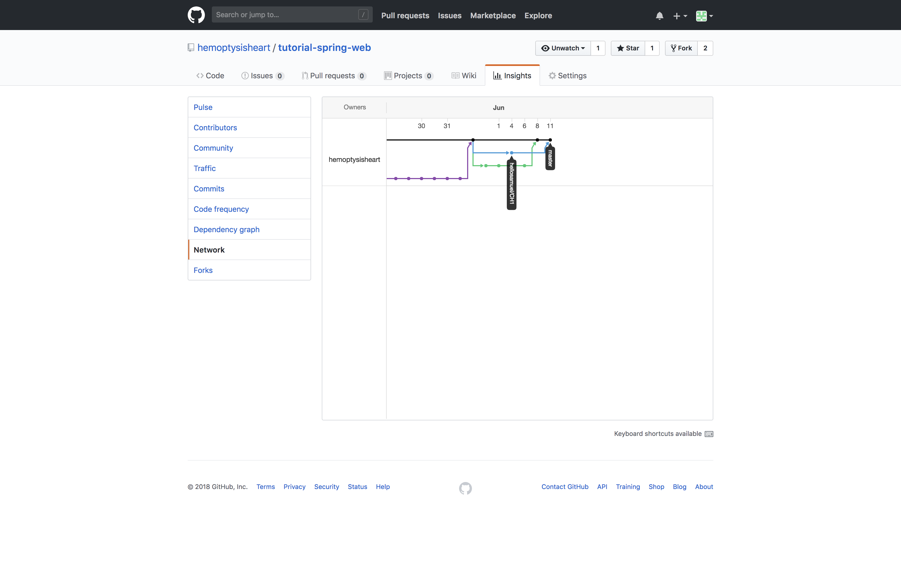

# CH.XX - Git 히스토리 정리

## 커밋 히스토리의 교차 현상

### 현상

프로젝트 저장소에 다음 순서로 작업이 발생했다.

1. `master` 브랜치가 c02b5479d862eabb3bc1ce0157f36d1c888f75b4 커밋일 때
[CH.09 - 안정성 개선](../09/readme.md)의 `ch9_enhance_stablility` 브랜치가 작업을 시작.
1. `master` 브랜치가 동일하게 c02b5479d862eabb3bc1ce0157f36d1c888f75b4 커밋일 때
수정사항 [`CH1`](/hellosamuel/tutorial-spring-web/tree/CH1)이 발생.
1. [`CH1`](/hellosamuel/tutorial-spring-web/tree/CH1)에서 [Pull Request #1](/hemoptysisheart/tutorial-spring-web/pull/1)가 생성.
1. [CH.09 - 안정성 개선](../09/readme.md)의 `ch9_enhance_stablility` 브랜치가 작업을 끝내고 저장소에 반영.
1. [Pull Request #1](/hemoptysisheart/tutorial-spring-web/pull/1)가 병합.

그 결과 Git 커밋 히스토리에 교차 현상(L.5 ~ 6)이 나타난다.

```
 0 *   c420f27 - (HEAD -> chXX_cleanup_git_history, origin/master, origin/HEAD) Merge pull request #1 from hemoptysisheart/hellosamuel/CH1 (3 weeks ago) <H2>
 1 |\
 2 | * 3c03cac - (origin/hellosamuel/CH1) (EDIT) 문서 오탈자수정. (4 weeks ago) <Lee Samuel>
 3 * |   4ed8393 - Merge branch 'ch9_enhance_stability' (3 weeks ago) <hemoptysisheart>
 4 |\ \
 5 | |/
 6 |/|
 7 | * 7a4b947 - (ADD) C9S3 - 모니터링 로그 (3 weeks ago) <hemoptysisheart>
 8 | * d7f1660 - (ADD) C9S2 - 디버깅 로그 (4 weeks ago) <hemoptysisheart>
 9 | * 063f71d - (ADD) C9S1 - 코드 공통화 : 폼 페이지 출력 (4 weeks ago) <hemoptysisheart>
10 |/
11 *   c02b547 - Merge branch 'ch8_enhance_project_structure' (4 weeks ago) <hemoptysisheart>
```


커맨드라인에서 확인하는 커밋 네트워크는 알아보기가 좀 힘들다. 깃허브에서 제공하는 [커밋 네트워크](/hemoptysisheart/tutorial-spring-web/network)에서 확인하면,



풀리퀘스트를 병합하기 전에 하나의 커밋에서 두 브랜치가 가지를 쳐서 나오고, 그 중 하나가 먼저 작업을 끝내고 `master` 브랜치에 병합된 것을 확인할 수 있다.

그리고 풀리퀘스트를 그대로 병합하면



이렇게 커밋 네트워크가 교차한다.
커밋 네트워크를 그리는 방식에 따라선 교차하지 않도록 만들 수도 있긴 하지만, 커밋 네트워크의 폭은 3가닥으로, 줄어들지 않는다.

### 문제점

1. 커밋 히스토리의 교차 현상은 현재의 브랜치/커밋의 **변경이력을 읽기 어렵게 만드는 주요 원인**이다.
1. 커밋 네트워크에서 동시에 그려지는 가닥은 **동시에 고려해야 하는 범위**이다.
1. 동시에 과거의 커밋을 기준으로 작성한 변경은 **충돌의 주요 원인**이다.

### 방지 원칙

1. 작업은 기준 브랜치(이 경우 `master`)의 현재 커밋에서 시작한다.
1. 기준 브랜치의 현재 커밋을 가지지 않은 작업은 병합하지 않는다.